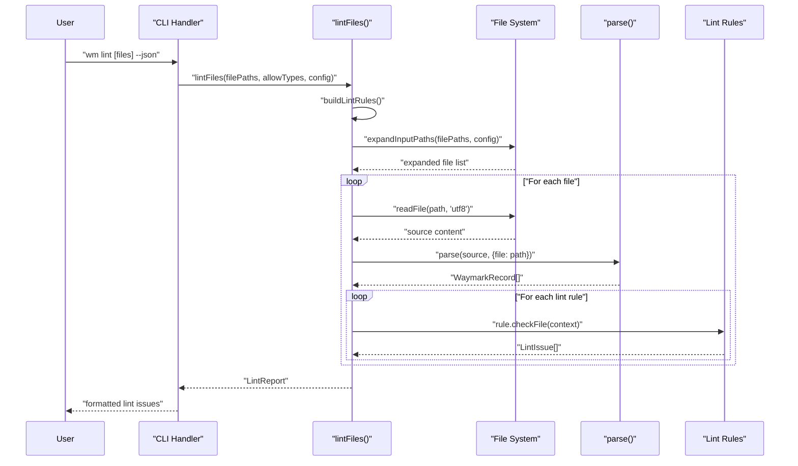

<!-- tldr ::: PR log for adding multiple-tldr lint rule enforcement -->

# PR #100: feat: add multiple-tldr lint rule

**Branch:** feat-add-multiple-tldr-lint-rule  
**State:** open  
**Last Updated:** Dec 31, 2025 at 05:03 PM

## Comments (1)

### @[object Object] • Dec 29, 2025 at 10:46 PM

General

<h3>Greptile Summary</h3>

- Implements a new `multiple-tldr` lint rule to enforce that files contain at most one TLDR waymark, aligning with project documentation standards
- Adds comprehensive test coverage for the new lint rule following existing testing patterns in the CLI package

<h3>Important Files Changed</h3>

| Filename | Overview |
|----------|----------|
| packages/cli/src/commands/lint.ts | Added `multipleTldrRule` with error severity to prevent multiple TLDR waymarks per file |
| packages/cli/src/index.test.ts | Added test case to validate the multiple-tldr lint rule detects violations correctly |

<h3>Confidence score: 3/5</h3>

- This PR is safe to merge but has minor concerns that should be addressed
- Score lowered due to an unrelated `.beads/` addition in .gitignore that doesn't match the PR's stated purpose
- Pay close attention to the .gitignore change to confirm if it should be included or removed

<h3>Sequence Diagram</h3>



---

## Reviews (4)

### @[object Object] • Dec 29, 2025 at 10:46 PM • commented

**style:** Unnecessary null check since `filter` always returns an array

```suggestion
    const first = tldrs[0];
    return tldrs.slice(1).map((record) => ({
      file: filePath,
```

<sub>Note: If this suggestion doesn't match your team's coding style, reply to this and let me know. I'll remember it for next time!</sub>

<details><summary>Prompt To Fix With AI</summary>

`````markdown
This is a comment left during a code review.
Path: packages/cli/src/commands/lint.ts
Line: 274:276

Comment:
**style:** Unnecessary null check since `filter` always returns an array

```suggestion
    const first = tldrs[0];
    return tldrs.slice(1).map((record) => ({
      file: filePath,
```

<sub>Note: If this suggestion doesn't match your team's coding style, reply to this and let me know. I'll remember it for next time!</sub>

How can I resolve this? If you propose a fix, please make it concise.
`````

</details>

---

### @[object Object] • Dec 29, 2025 at 10:46 PM • commented

**style:** Message references 'tldr' but should use actual record type for consistency

<sub>Note: If this suggestion doesn't match your team's coding style, reply to this and let me know. I'll remember it for next time!</sub>

<details><summary>Prompt To Fix With AI</summary>

`````markdown
This is a comment left during a code review.
Path: packages/cli/src/commands/lint.ts
Line: 283:283

Comment:
**style:** Message references 'tldr' but should use actual record type for consistency

<sub>Note: If this suggestion doesn't match your team's coding style, reply to this and let me know. I'll remember it for next time!</sub>

How can I resolve this? If you propose a fix, please make it concise.
`````

</details>

---

### @[object Object] • Dec 29, 2025 at 10:46 PM • commented

<sub>3 files reviewed, 2 comments</sub>

<sub>[Edit Code Review Agent Settings](https://app.greptile.com/review/github) | [Greptile](https://greptile.com?utm_source=greptile_expert&utm_medium=github&utm_campaign=code_reviews&utm_content=waymark_100)</sub>

---

### @[object Object] • Dec 29, 2025 at 10:50 PM • commented

**<sub><sub></sub></sub>  Exclude doc examples from multiple‑tldr checks**

This rule counts every record with type `tldr` regardless of file category or comment leader, so Markdown docs that include example code blocks (e.g., README.md has multiple `// tldr :::` snippets plus the real `<!-- tldr ::: ... -->`) will now fail `wm lint` when run on docs or the repo root. Previously those example lines were harmless because the other rules don’t treat valid `tldr` markers as errors; with this change, `wm lint README.md` will exit with an error even though the doc’s only intended TLDR is the HTML comment. Consider filtering by `record.commentLeader`/`fileCategory` so only the doc‑style TLDR is counted in markdown files.

---

## CI Checks (0)

*No CI checks*
