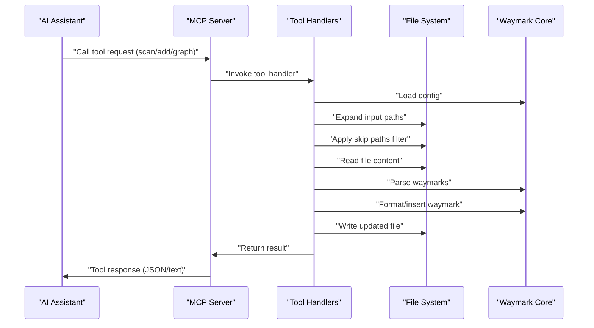

<!-- tldr ::: PR log for adding legacy-pattern lint rule detection -->

# PR #101: feat: add legacy-pattern lint rule

**Branch:** feat-add-legacy-pattern-lint-rule  
**State:** open  
**Last Updated:** Dec 31, 2025 at 05:03 PM

## Comments (1)

### @[object Object] • Dec 29, 2025 at 10:46 PM

General

<h3>Greptile Summary</h3>

- Adds legacy-pattern lint rule to detect traditional codetags (TODO, FIXME, NOTE) and suggest modern waymark syntax with `:::` sigil
- Includes comprehensive test coverage for the new lint rule to ensure proper detection of legacy comment patterns

<h3>Important Files Changed</h3>

| Filename | Overview |
|----------|----------|
| packages/cli/src/commands/lint.ts | Added legacy-pattern lint rule with codetag detection patterns and waymark syntax suggestions |
| packages/cli/src/index.test.ts | Added test case to verify legacy-pattern rule detects old codetag syntax and reports warnings |

<h3>Confidence score: 5/5</h3>

- This PR is safe to merge with minimal risk
- Score reflects well-structured implementation following existing patterns, comprehensive test coverage, and low-impact warning-level severity
- No files require special attention

<h3>Sequence Diagram</h3>

---

## Reviews (1)

### @[object Object] • Dec 29, 2025 at 10:47 PM • commented

**  Anchor legacy-codetag matches to real comments**

The new rule tests each regex against the entire line, so any line that *contains* `// TODO:`/`# TODO:`/`-- TODO:` will be flagged even if it’s inside a string literal or after an existing waymark (e.g., a valid `// todo :::` comment whose message mentions “TODO:” or a `const x = "// TODO: ..."`). This produces false positives for non-comment content and can make the lint noisy in files with example strings or documentation text. Anchoring matches to leading whitespace + the comment leader, or stripping string literals before testing, would avoid warning on non-codetag usage.

---

## CI Checks (0)

*No CI checks*
