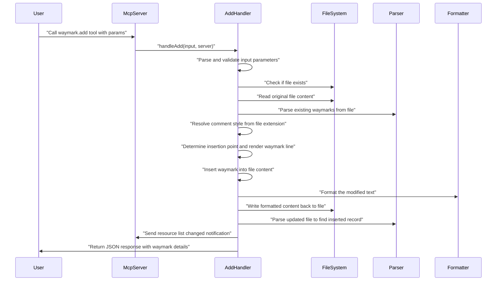

<!-- tldr ::: PR log for adding include codetags option to scan command -->

# PR #102: feat: add include codetags scan option

**Branch:** feat-add-include-codetags-scan-option  
**State:** open  
**Last Updated:** Dec 31, 2025 at 05:03 PM

## Comments (1)

### @[object Object] • Dec 29, 2025 at 10:47 PM

General

<h3>Greptile Summary</h3>

- Add `scan.includeCodetags` configuration option to enable scanning of legacy code comments (TODO, FIXME, NOTE) alongside modern waymark syntax
- Implement legacy pattern recognition with regex-based scanning that converts traditional codetags to synthetic waymark records with a `legacy` flag
- Extend type definitions and configuration system with proper YAML parsing support, following established patterns for object merging and camelCase/snake_case handling

<h3>Important Files Changed</h3>

| Filename | Overview |
|----------|----------|
| packages/cli/src/commands/scan.ts | Added legacy codetag scanning with regex patterns and synthetic record generation for traditional comment styles |
| packages/core/src/config.ts | Extended configuration system with scan.includeCodetags option and proper normalization support |

<h3>Confidence score: 4/5</h3>

- This PR is generally safe to merge with proper implementation of a well-scoped feature addition
- Score reflects solid implementation with good test coverage, but complexity in legacy pattern matching warrants careful testing
- Pay close attention to `packages/cli/src/commands/scan.ts` for the regex pattern matching and synthetic record generation logic

<h3>Sequence Diagram</h3>



---

## Reviews (4)

### @[object Object] • Dec 29, 2025 at 10:47 PM • commented

**logic:** Setting all parsed fields to empty arrays/objects overwrites any data that might have been parsed from the synthetic waymark

<details><summary>Prompt To Fix With AI</summary>

`````markdown
This is a comment left during a code review.
Path: packages/cli/src/commands/scan.ts
Line: 52:61

Comment:
**logic:** Setting all parsed fields to empty arrays/objects overwrites any data that might have been parsed from the synthetic waymark

How can I resolve this? If you propose a fix, please make it concise.
`````

</details>

---

### @[object Object] • Dec 29, 2025 at 10:47 PM • commented

**style:** XXX is mapped to 'fix' marker - is this the intended behavior or should it be 'warn' or another marker? Should XXX comments be mapped to 'fix' or would 'warn' or another marker be more appropriate?

<sub>Note: If this suggestion doesn't match your team's coding style, reply to this and let me know. I'll remember it for next time!</sub>

<details><summary>Prompt To Fix With AI</summary>

`````markdown
This is a comment left during a code review.
Path: packages/cli/src/commands/scan.ts
Line: 28:28

Comment:
**style:** XXX is mapped to 'fix' marker - is this the intended behavior or should it be 'warn' or another marker? Should XXX comments be mapped to 'fix' or would 'warn' or another marker be more appropriate?

<sub>Note: If this suggestion doesn't match your team's coding style, reply to this and let me know. I'll remember it for next time!</sub>

How can I resolve this? If you propose a fix, please make it concise.
`````

</details>

---

### @[object Object] • Dec 29, 2025 at 10:47 PM • commented

<details open><summary><h3>Additional Comments (1)</h3></summary>

1. `packages/core/src/types.ts`, line 58 ([link](/outfitter-dev/waymark/blob/53373a378015412ca8f874d933f376a39378eecb/packages/core/src/types.ts#L58))

   **syntax:** Duplicate import of WaymarkRecord - already imported from @waymarks/grammar on line 4

</details>

<sub>6 files reviewed, 3 comments</sub>

<sub>[Edit Code Review Agent Settings](https://app.greptile.com/review/github) | [Greptile](https://greptile.com?utm_source=greptile_expert&utm_medium=github&utm_campaign=code_reviews&utm_content=waymark_102)</sub>

---

### @[object Object] • Dec 29, 2025 at 10:51 PM • commented

**<sub><sub></sub></sub>  Add legacy field to scan JSON schema**

When `scan.includeCodetags` is enabled, legacy records are emitted with `legacy: true`, but `schemas/waymark-record.schema.json` disallows additional properties and doesn’t define `legacy`. Any consumer validating `wm scan --json` output against that schema will now fail on legacy records. Consider updating the schema to include a `legacy` boolean (or omit the property in JSON output) so the published contract matches the new output.

---

## CI Checks (0)

*No CI checks*
