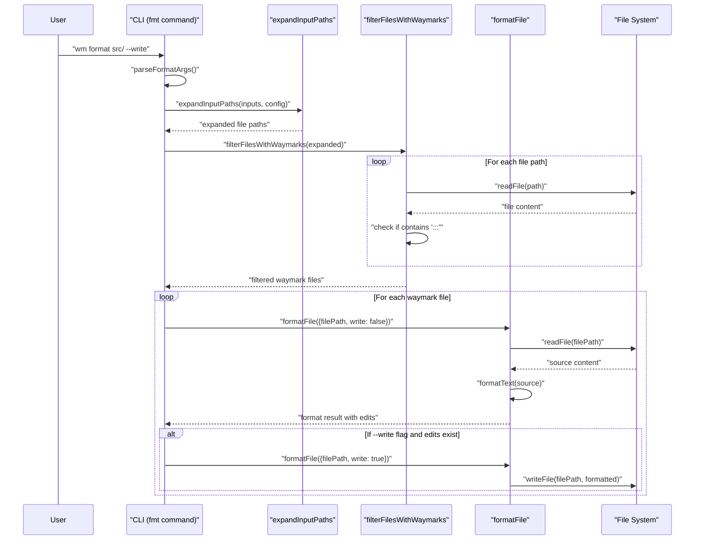

# PR #104: feat: expand format to directories

**Branch:** feat-expand-format-to-directories  
**State:** open  
**Last Updated:** Dec 31, 2025 at 05:03 PM

## Comments (1)

### @[object Object] • Dec 29, 2025 at 10:47 PM

General

<h3>Greptile Summary</h3>

- Expands the `format` command to accept directories and automatically discover waymark files
- Introduces directory expansion functionality with filtering for files containing waymarks using simple `:::` sigil detection
- Updates command interface to handle multiple file paths while maintaining backward compatibility with single files

<h3>Important Files Changed</h3>

| Filename | Overview |
|----------|----------|
| packages/cli/src/index.ts | Updates format command to handle multiple paths with directory expansion and graceful "no waymarks found" messaging |
| packages/cli/src/commands/fmt.ts | Adds `expandFormatPaths` and `filterFilesWithWaymarks` functions for directory support and waymark detection |

<h3>Confidence score: 3/5</h3>

- This PR introduces useful directory support functionality but uses a potentially fragile waymark detection method
- Score lowered due to simple string matching approach that could produce false positives and missing imports for file system operations
- Pay close attention to `packages/cli/src/commands/fmt.ts` for the waymark filtering implementation and missing imports

<h3>Sequence Diagram</h3>



---

## Reviews (4)

### @[object Object] • Dec 29, 2025 at 10:47 PM • commented

**syntax:** Error message should be updated to reflect that multiple file paths are accepted

```suggestion
    throw new Error("fmt requires at least one file path");
```

<details><summary>Prompt To Fix With AI</summary>

`````markdown
This is a comment left during a code review.
Path: packages/cli/src/commands/fmt.ts
Line: 67:67

Comment:
**syntax:** Error message should be updated to reflect that multiple file paths are accepted

```suggestion
    throw new Error("fmt requires at least one file path");
```

How can I resolve this? If you propose a fix, please make it concise.
`````

</details>

---

### @[object Object] • Dec 29, 2025 at 10:47 PM • commented

**syntax:** Error message is misleading - now accepts multiple file paths, not just one

```suggestion
    throw new Error("fmt requires at least one file path");
```

<details><summary>Prompt To Fix With AI</summary>

`````markdown
This is a comment left during a code review.
Path: packages/cli/src/commands/fmt.ts
Line: 59:59

Comment:
**syntax:** Error message is misleading - now accepts multiple file paths, not just one

```suggestion
    throw new Error("fmt requires at least one file path");
```

How can I resolve this? If you propose a fix, please make it concise.
`````

</details>

---

### @[object Object] • Dec 29, 2025 at 10:47 PM • commented

<sub>2 files reviewed, 2 comments</sub>

<sub>[Edit Code Review Agent Settings](https://app.greptile.com/review/github) | [Greptile](https://greptile.com?utm_source=greptile_expert&utm_medium=github&utm_campaign=code_reviews&utm_content=waymark_104)</sub>

---

### @[object Object] • Dec 29, 2025 at 10:49 PM • commented

**<sub><sub></sub></sub>  Surface read/permission errors when scanning format targets**

Because `filterFilesWithWaymarks` swallows *all* read failures (`readFile(...).catch(() => null)`) and treats them as “no waymarks,” `wm format` will now silently skip unreadable inputs (e.g., permission errors or transient I/O failures) and can exit 0 with “format: no waymarks found” even though the user explicitly provided a file; previously `formatFile` would throw and the command would fail. This makes it easy to miss real failures and gives a false success in the exact cases where users need feedback.

---

## CI Checks (0)

*No CI checks*
