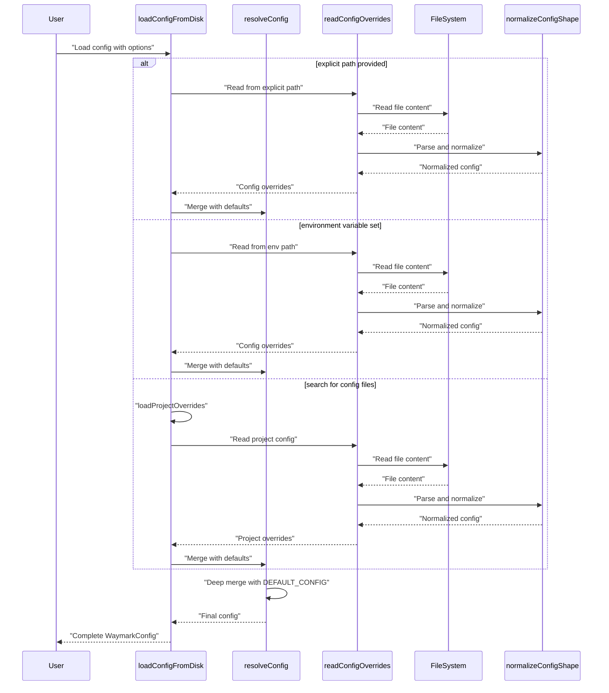

<!-- tldr ::: PR log for expanding default skip paths in configuration -->

# PR #105: chore: expand default skip paths

**Branch:** chore-expand-default-skip-paths  
**State:** open  
**Last Updated:** Dec 31, 2025 at 05:03 PM

## Comments (1)

### @[object Object] • Dec 29, 2025 at 10:47 PM

General

<h3>Greptile Summary</h3>

- Expands default skip paths in `packages/core/src/config.ts` to exclude common test fixture directories and files from waymark scanning/formatting

<h3>Important Files Changed</h3>

| Filename | Overview |
|----------|----------|
| packages/core/src/config.ts | Added five new skip path patterns for test fixtures and invalid files (fixtures/**, test-data/**, *.fixture.*, *.invalid.*) |

<h3>Confidence score: 5/5</h3>

- This PR is safe to merge with minimal risk
- Score reflects simple addition of skip paths with clear intent to exclude test fixtures that shouldn't contain waymarks
- No files require special attention

<h3>Sequence Diagram</h3>

---

## Reviews (0)

*No reviews*

## CI Checks (0)

*No CI checks*
