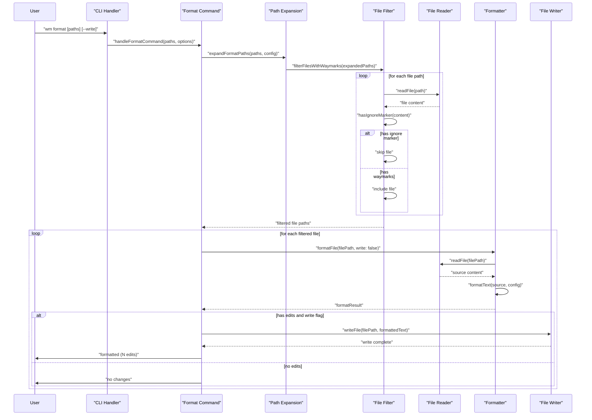

# PR #106: feat: skip waymark-ignore-file during format

**Branch:** feat-skip-waymark-ignore-file-during-format  
**State:** open  
**Last Updated:** Dec 31, 2025 at 05:03 PM

## Comments (1)

### @[object Object] • Dec 29, 2025 at 10:47 PM

General

<h3>Greptile Summary</h3>

- Adds support for `waymark-ignore-file` marker to skip files during format operations
- Implements pattern matching to detect ignore markers in multiple comment styles (JS, shell, SQL, HTML)
- Adds comprehensive test coverage to verify the ignore functionality works correctly

<h3>Important Files Changed</h3>

| Filename | Overview |
|----------|----------|
| packages/cli/src/commands/fmt.ts | Added `hasIgnoreMarker` function and regex pattern to detect and skip files with waymark-ignore-file marker during format operations |
| packages/cli/src/index.test.ts | Added test case to verify expandFormatPaths correctly excludes files containing waymark-ignore-file marker |

<h3>Confidence score: 4/5</h3>

- This PR appears mostly safe but has one potential issue requiring attention
- Score reduced due to hardcoded line scanning limit that could miss ignore markers in files with many initial comments
- Pay close attention to the implementation logic in `packages/cli/src/commands/fmt.ts`

<h3>Sequence Diagram</h3>

---

## Reviews (0)

*No reviews*

## CI Checks (0)

*No CI checks*
