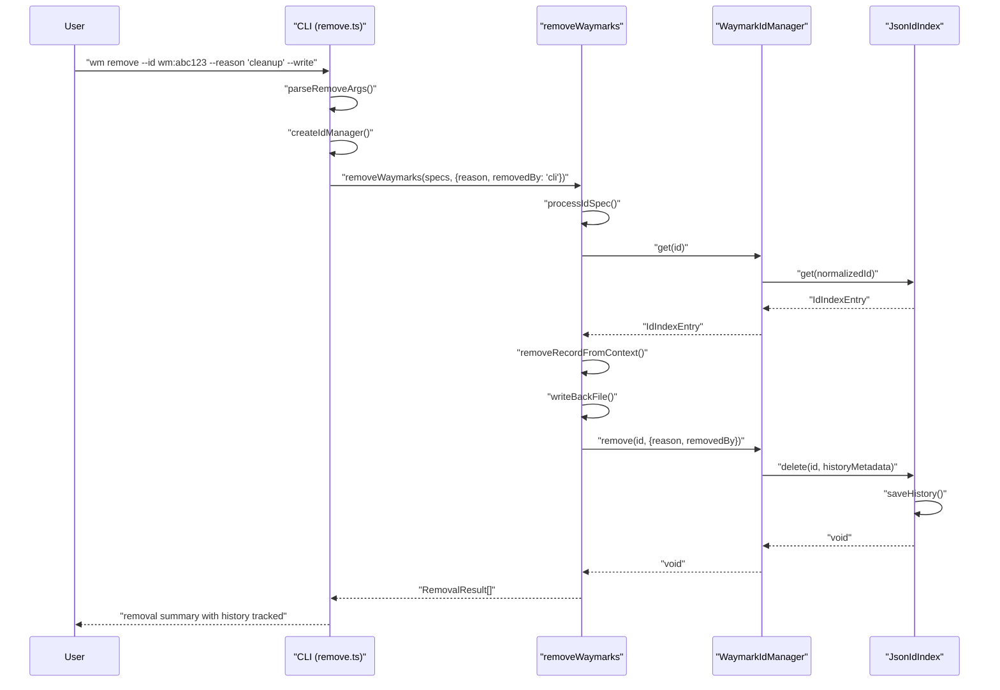

<!-- tldr ::: PR log for adding removal history metadata tracking -->

# PR #107: feat: add removal history metadata

**Branch:** feat-add-removal-history-metadata  
**State:** open  
**Last Updated:** Dec 31, 2025 at 05:03 PM

## Comments (1)

### @[object Object] • Dec 29, 2025 at 10:47 PM

General

<h3>Greptile Summary</h3>

- Adds removal history metadata tracking to waymark deletion operations, introducing optional `reason` and `removedBy` parameters for audit trail purposes
- Implements a new `--reason` CLI flag that allows users to record why waymarks are being removed, automatically tagging CLI operations with `removedBy: "cli"`
- Updates core interfaces and type signatures to support partial history metadata, making the system more flexible by allowing optional inclusion of removal context

<h3>Important Files Changed</h3>

| Filename | Overview |
|----------|----------|
| packages/core/src/id-index.ts | Modified history tracking type signature to accept partial metadata instead of requiring all fields, improving flexibility for deletion operations |
| packages/core/src/ids.ts | Enhanced WaymarkIdManager.remove() to accept optional reason/removedBy parameters and pass them to index deletion for history tracking |
| packages/core/src/remove.ts | Added reason and removedBy fields to RemoveOptions interface and implemented metadata passing to ID manager during removal operations |

<h3>Confidence score: 4/5</h3>

- This PR is largely safe to merge with minimal production risks as it extends existing functionality without breaking changes
- Score reflects solid implementation following established patterns, though the lack of testing raises some concerns about edge cases and integration
- Pay close attention to the type signature change in `id-index.ts` to ensure it doesn't break existing callers expecting the previous interface

<h3>Sequence Diagram</h3>

---

## Reviews (1)

### @[object Object] • Dec 29, 2025 at 10:51 PM • commented

**  Avoid hardcoding removedBy to "cli" for core removals**

When `WaymarkIdManager.remove` is called without an explicit `removedBy` (e.g., from non-CLI integrations like API/MCP or any library consumer of `@waymarks/core`), the history entry is still stamped with `"cli"` because of the default here. This misattributes removals in audit history for any caller that isn’t the CLI. Since the CLI already passes `removedBy: "cli"`, consider leaving `removedBy` undefined by default and only setting it when a caller supplies it.

---

## CI Checks (0)

*No CI checks*
