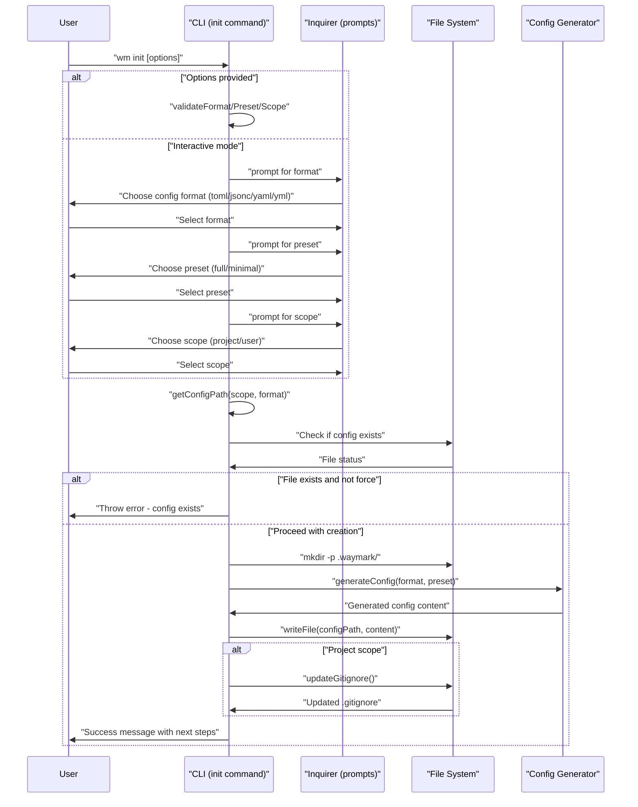

<!-- tldr ::: PR log for removing protected branch policy configuration -->

# PR #108: chore: remove protected branch policy

**Branch:** chore-remove-protected-branch-policy  
**State:** open  
**Last Updated:** Dec 31, 2025 at 05:03 PM

## Comments (1)

### @[object Object] • Dec 29, 2025 at 10:47 PM

General

<h3>Greptile Summary</h3>

- Removes protected branch policy feature from Waymark configuration system including `protectedBranches` and `signalsOnProtected` fields
- Updates all config templates (TOML, JSONC, YAML) and schema files to eliminate branch protection functionality

<h3>Important Files Changed</h3>

| Filename | Overview |
|----------|----------|
| packages/core/src/types.ts | Removed `protectedBranches` and `signalsOnProtected` from WaymarkConfig types |
| packages/core/src/config.ts | Eliminated protected branches parsing logic and configuration defaults |
| packages/cli/src/commands/doctor.ts | Removed protected branch validation checks and git branch detection logic |
| schemas/waymark-config.schema.json | Updated schema to remove protected branch properties and add new scan options |

<h3>Confidence score: 5/5</h3>

- This PR is safe to merge with minimal risk
- Score reflects straightforward configuration cleanup with no logic errors or breaking changes
- No files require special attention as all changes are consistent configuration removals

<h3>Sequence Diagram</h3>

---

## Reviews (1)

### @[object Object] • Dec 29, 2025 at 10:47 PM • commented

<h3>Additional Comments (1)</h3>

1. `.waymark/config.jsonc`, line 24-26 ([link](/outfitter-dev/waymark/blob/96763d2c9585ab3d20034bc8a534a30b25bf48fb/.waymark/config.jsonc#L24-L26))

   **style:** existing waymarks need cleanup - remove agent mentions and fix grammar issues

   Note: If this suggestion doesn't match your team's coding style, reply to this and let me know. I'll remember it for next time!

9 files reviewed, 1 comment

[Edit Code Review Agent Settings](https://app.greptile.com/review/github) | [Greptile](https://greptile.com?utm_source=greptile_expert&utm_medium=github&utm_campaign=code_reviews&utm_content=waymark_108)

---

## CI Checks (0)

*No CI checks*
