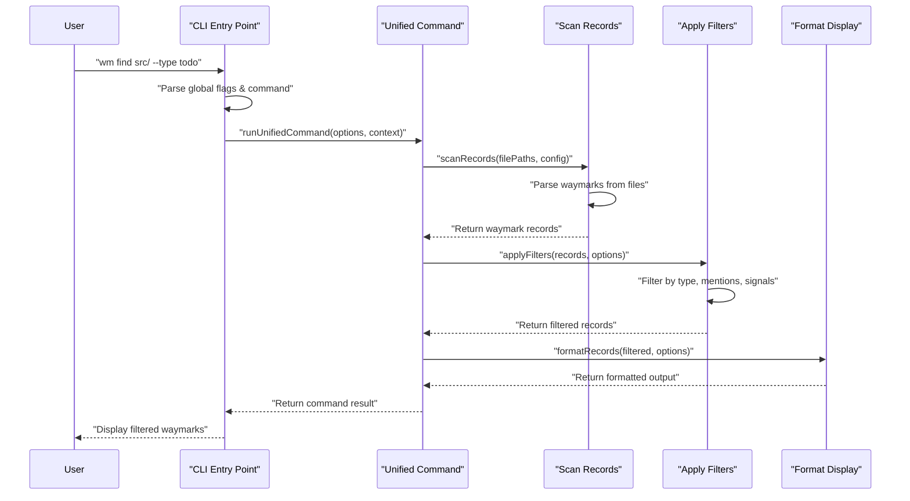

<!-- tldr ::: PR log for updating README documentation for v1 changes -->

# PR #109: docs: update README for v1 changes

**Branch:** docs-update-README-for-v1-changes  
**State:** open  
**Last Updated:** Dec 31, 2025 at 05:03 PM

## Comments (1)

### @[object Object] • Dec 29, 2025 at 10:47 PM

General

<h3>Greptile Summary</h3>

- Updates README to reflect v1 CLI and configuration changes in the primary documentation
- Restructures "Start Here" section with new file organization and reference patterns

<h3>Important Files Changed</h3>

| Filename | Overview |
|----------|----------|
| README.md | Documentation update with broken file path references and incomplete code blocks requiring fixes |

<h3>Confidence score: 1/5</h3>

- This PR contains multiple critical issues that will break documentation navigation and user experience
- Score lowered due to broken file path references (docs/waymark/SPEC.md, .waymark/rules/CONVENTIONS.md don't exist), incomplete code blocks with missing closing backticks, and inconsistent repository structure references
- README.md requires immediate attention to fix path errors and formatting issues before merge

<h3>Sequence Diagram</h3>



---

## Reviews (2)

### @[object Object] • Dec 29, 2025 at 10:47 PM • commented

**logic:** Reference to `docs/waymark/SPEC.md` - this file doesn't exist in the repository. Should this be `docs/GRAMMAR.md` or another existing file?

```suggestion
1. **Specification**: [Waymark Specification](docs/GRAMMAR.md) defines the grammar, tooling scope, and roadmap.
2. **Grammar Reference**: [Waymark Grammar](docs/GRAMMAR.md) mirrors the specification for quick lookup.
```

 Has the SPEC.md file been created yet, or should this reference point to an existing specification file?

<details><summary>Prompt To Fix With AI</summary>

`````markdown
This is a comment left during a code review.
Path: README.md
Line: 64:65

Comment:
**logic:** Reference to `docs/waymark/SPEC.md` - this file doesn't exist in the repository. Should this be `docs/GRAMMAR.md` or another existing file?

```suggestion
1. **Specification**: [Waymark Specification](docs/GRAMMAR.md) defines the grammar, tooling scope, and roadmap.
2. **Grammar Reference**: [Waymark Grammar](docs/GRAMMAR.md) mirrors the specification for quick lookup.
```

 Has the SPEC.md file been created yet, or should this reference point to an existing specification file?

How can I resolve this? If you propose a fix, please make it concise.
`````

</details>

---

### @[object Object] • Dec 29, 2025 at 10:47 PM • commented

<details open><summary><h3>Additional Comments (1)</h3></summary>

1. `README.md`, line 57-61 ([link](/outfitter-dev/waymark/blob/ad98cb4ca839b90b60779546dd6d423e0abdc47b/README.md#L57-L61))

   **syntax:** Code block is not properly closed with backticks, causing formatting issues

</details>

<sub>1 file reviewed, 2 comments</sub>

<sub>[Edit Code Review Agent Settings](https://app.greptile.com/review/github) | [Greptile](https://greptile.com?utm_source=greptile_expert&utm_medium=github&utm_campaign=code_reviews&utm_content=waymark_109)</sub>

---

## CI Checks (0)

*No CI checks*
