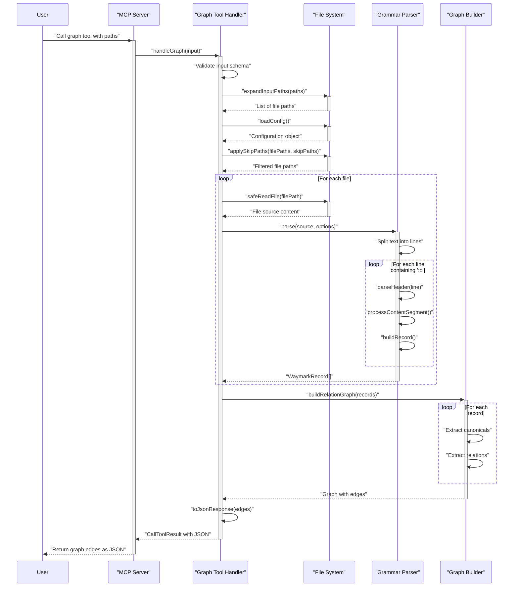

<!-- tldr ::: PR log for updating grammar references and lint rule documentation -->

# PR #110: docs: update grammar references and lint rules

**Branch:** docs-update-grammar-references-and-lint-rules  
**State:** open  
**Last Updated:** Dec 31, 2025 at 05:03 PM

## Comments (1)

### @[object Object] • Dec 29, 2025 at 10:47 PM

General

<h3>Greptile Summary</h3>

- Updates grammar documentation to remove references to unimplemented advanced features like protected branch enforcement
- Simplifies lint rules to focus on core validation (unknown markers, duplicate properties, legacy patterns)

<h3>Important Files Changed</h3>

| Filename | Overview |
|----------|----------|
| docs/GRAMMAR.md | Removed advanced feature references and updated lint rules to reflect current v1 implementation scope |

<h3>Confidence score: 5/5</h3>

- This PR is extremely safe to merge with minimal risk
- Score reflects clean documentation updates that align with v1 rewrite scope by removing unimplemented features
- No files require special attention

<h3>Sequence Diagram</h3>



---

## Reviews (2)

### @[object Object] • Dec 29, 2025 at 10:47 PM • commented

**logic:** Reference path appears incorrect - `waymark/SPEC.md` doesn't exist in the repository structure shown. Should this reference point to `../PRD.md` instead, or does this file exist in a different location?

<details><summary>Prompt To Fix With AI</summary>

`````markdown
This is a comment left during a code review.
Path: docs/GRAMMAR.md
Line: 945:945

Comment:
**logic:** Reference path appears incorrect - `waymark/SPEC.md` doesn't exist in the repository structure shown. Should this reference point to `../PRD.md` instead, or does this file exist in a different location?

How can I resolve this? If you propose a fix, please make it concise.
`````

</details>

---

### @[object Object] • Dec 29, 2025 at 10:47 PM • commented

<sub>1 file reviewed, 1 comment</sub>

<sub>[Edit Code Review Agent Settings](https://app.greptile.com/review/github) | [Greptile](https://greptile.com?utm_source=greptile_expert&utm_medium=github&utm_campaign=code_reviews&utm_content=waymark_110)</sub>

---

## CI Checks (0)

*No CI checks*
