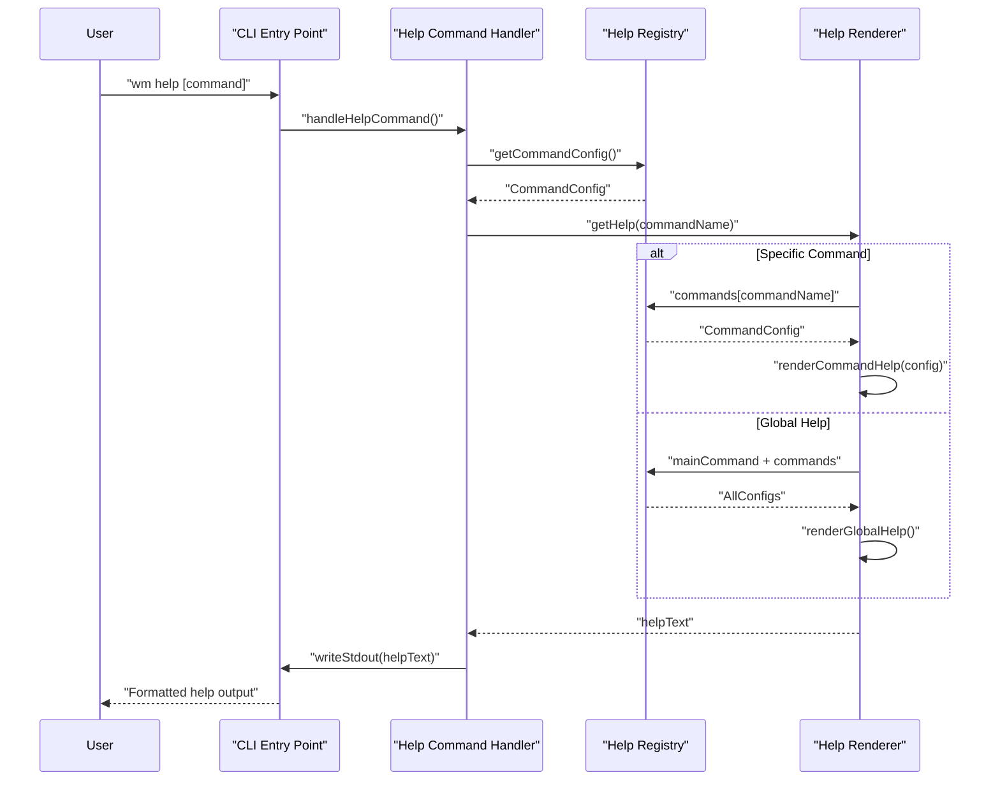

# PR #111: docs: refresh CLI help text

**Branch:** docs-refresh-CLI-help-text  
**State:** open  
**Last Updated:** Dec 31, 2025 at 05:03 PM

## Comments (1)

### @[object Object] • Dec 29, 2025 at 10:47 PM

General

<h3>Greptile Summary</h3>

- Updates CLI help documentation for `format` and `remove` commands to reflect their current capabilities and new features
- Adds documentation for new `--reason` flag in remove command and file:line syntax support for direct waymark targeting
- Enhances format command documentation to show it accepts multiple paths/directories instead of single files

<h3>Important Files Changed</h3>

| Filename | Overview |
|----------|----------|
| packages/cli/src/commands/format.prompt.ts | Updated format command documentation to show multiple paths support and added waymark-ignore-file directive tip |
| packages/cli/src/commands/format.help.ts | Refreshed format command help text with correct usage syntax and directory formatting examples |
| packages/cli/src/commands/remove.prompt.ts | Added extensive documentation for new file:line removal syntax and --reason flag functionality |

<h3>Confidence score: 5/5</h3>

- This PR is safe to merge with minimal risk as it only contains documentation updates
- Score reflects that these are purely documentation changes with no functional code modifications
- No files require special attention as all changes improve CLI user experience through better help text

<h3>Sequence Diagram</h3>



---

## Reviews (2)

### @[object Object] • Dec 29, 2025 at 10:47 PM • commented

**logic:** Syntax inconsistency - this shows --reason as required but line 10 shows it as optional

```suggestion
  wm remove <file:line> [--write] [--reason "<text>"]
```

 Should --reason be required or optional when using the file:line syntax?

<details><summary>Prompt To Fix With AI</summary>

`````markdown
This is a comment left during a code review.
Path: packages/cli/src/commands/remove.prompt.ts
Line: 14:14

Comment:
**logic:** Syntax inconsistency - this shows --reason as required but line 10 shows it as optional

```suggestion
  wm remove <file:line> [--write] [--reason "<text>"]
```

 Should --reason be required or optional when using the file:line syntax?

How can I resolve this? If you propose a fix, please make it concise.
`````

</details>

---

### @[object Object] • Dec 29, 2025 at 10:47 PM • commented

<sub>5 files reviewed, 1 comment</sub>

<sub>[Edit Code Review Agent Settings](https://app.greptile.com/review/github) | [Greptile](https://greptile.com?utm_source=greptile_expert&utm_medium=github&utm_campaign=code_reviews&utm_content=waymark_111)</sub>

---

## CI Checks (0)

*No CI checks*
