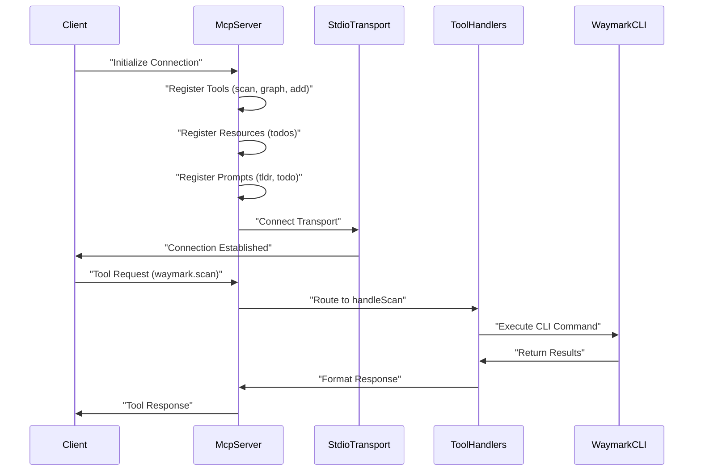

<!-- tldr ::: PR log for formatting staged pre-commit and moving help assets -->

# PR #112: chore: format staged pre-commit and move help assets

**Branch:** chore/format-staged-and-help-assets  
**State:** open  
**Last Updated:** Dec 31, 2025 at 05:03 PM

## Comments (1)

### @[object Object] • Dec 29, 2025 at 10:47 PM

General

<h3>Greptile Summary</h3>

- Introduces selective pre-commit formatting with new `format:staged` script to only format staged files instead of entire repository
- Extracts help and prompt text from 11 TypeScript files into separate `.txt` assets for better maintainability and separation of concerns
- Adds TypeScript declarations for importing `.txt` files and updates git hooks to use the new staging-focused formatting workflow

<h3>Important Files Changed</h3>

| Filename | Overview |
|----------|----------|
| `scripts/format-staged.ts` | New script implementing selective formatting of staged files with proper error handling and file filtering |
| `packages/cli/src/assets.d.ts` | New TypeScript declarations enabling `.txt` file imports as string modules |

<h3>Confidence score: 5/5</h3>

- This PR is extremely safe to merge with minimal risk of production issues
- Score reflects comprehensive asset reorganization with no logic changes and improved code organization patterns
- No files require special attention as changes are purely organizational and maintain existing functionality

<h3>Sequence Diagram</h3>



---

## Reviews (6)

### @[object Object] • Dec 29, 2025 at 10:47 PM • commented

**style:** intermediate variable unnecessary - could directly export the import

```suggestion
export default content;
```

<sub>Note: If this suggestion doesn't match your team's coding style, reply to this and let me know. I'll remember it for next time!</sub>

<details><summary>Prompt To Fix With AI</summary>

`````markdown
This is a comment left during a code review.
Path: packages/cli/src/commands/remove.prompt.ts
Line: 5:5

Comment:
**style:** intermediate variable unnecessary - could directly export the import

```suggestion
export default content;
```

<sub>Note: If this suggestion doesn't match your team's coding style, reply to this and let me know. I'll remember it for next time!</sub>

How can I resolve this? If you propose a fix, please make it concise.
`````

</details>

---

### @[object Object] • Dec 29, 2025 at 10:47 PM • commented

**syntax:** Example spacing inconsistent - shows `*  fix  :::` becoming `*fix :::` but should show proper spacing with `* fix :::`

```suggestion
  - // *  fix  ::: validate input
  + // * fix ::: validate input
```

<details><summary>Prompt To Fix With AI</summary>

`````markdown
This is a comment left during a code review.
Path: packages/cli/src/commands/format.prompt.txt
Line: 69:70

Comment:
**syntax:** Example spacing inconsistent - shows `*  fix  :::` becoming `*fix :::` but should show proper spacing with `* fix :::`

```suggestion
  - // *  fix  ::: validate input
  + // * fix ::: validate input
```

How can I resolve this? If you propose a fix, please make it concise.
`````

</details>

---

### @[object Object] • Dec 29, 2025 at 10:47 PM • commented

**style:** Intermediate variable is redundant - can directly export the imported content

```suggestion
export default content;
```

<sub>Note: If this suggestion doesn't match your team's coding style, reply to this and let me know. I'll remember it for next time!</sub>

<details><summary>Prompt To Fix With AI</summary>

`````markdown
This is a comment left during a code review.
Path: packages/cli/src/commands/modify.prompt.ts
Line: 5:5

Comment:
**style:** Intermediate variable is redundant - can directly export the imported content

```suggestion
export default content;
```

<sub>Note: If this suggestion doesn't match your team's coding style, reply to this and let me know. I'll remember it for next time!</sub>

How can I resolve this? If you propose a fix, please make it concise.
`````

</details>

---

### @[object Object] • Dec 29, 2025 at 10:47 PM • commented

**logic:** Formatting example shows '*fix' without space between* and fix - should align with line 21 rule about signal order

```suggestion
  // * fix ::: validate input
```

 Should there be a space between the * signal and 'fix' marker to match the formatting rule on line 21?

<details><summary>Prompt To Fix With AI</summary>

`````markdown
This is a comment left during a code review.
Path: packages/cli/src/commands/format.help.txt
Line: 45:45

Comment:
**logic:** Formatting example shows '*fix' without space between * and fix - should align with line 21 rule about signal order

```suggestion
  // * fix ::: validate input
```

 Should there be a space between the * signal and 'fix' marker to match the formatting rule on line 21?

How can I resolve this? If you propose a fix, please make it concise.
`````

</details>

---

### @[object Object] • Dec 29, 2025 at 10:47 PM • commented

**style:** References WM001 error code but earlier examples use rule names. Should this reference use rule names for consistency with the rest of the file?

<details><summary>Prompt To Fix With AI</summary>

`````markdown
This is a comment left during a code review.
Path: packages/cli/src/commands/lint.prompt.txt
Line: 110:110

Comment:
**style:** References WM001 error code but earlier examples use rule names. Should this reference use rule names for consistency with the rest of the file?

How can I resolve this? If you propose a fix, please make it concise.
`````

</details>

---

### @[object Object] • Dec 29, 2025 at 10:47 PM • commented

<sub>18 files reviewed, 5 comments</sub>

<sub>[Edit Code Review Agent Settings](https://app.greptile.com/review/github) | [Greptile](https://greptile.com?utm_source=greptile_expert&utm_medium=github&utm_campaign=code_reviews&utm_content=waymark_112)</sub>

---

## CI Checks (0)

*No CI checks*
