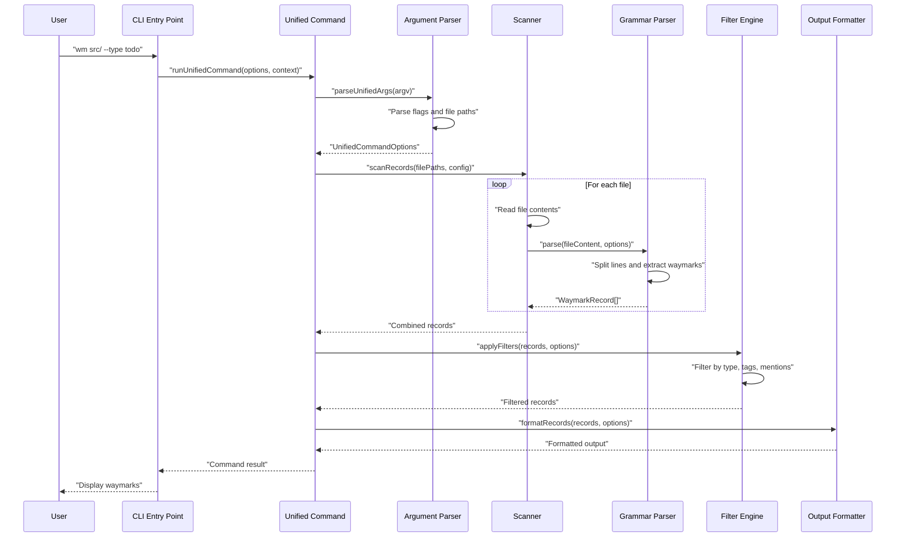

# PR #113: docs: align v1 docs with spec and CLI updates

**Branch:** docs-align-v1-docs-with-spec-and-CLI-updates  
**State:** open  
**Last Updated:** Dec 31, 2025 at 05:03 PM

## Comments (1)

### @[object Object] • Dec 29, 2025 at 10:48 PM

General

<h3>Greptile Summary</h3>

- Comprehensive documentation update aligning all references from deprecated PRD.md to current SPEC.md structure and updating CLI command references to match v1 implementation
- Integration of Beads issue tracking system with JSONL-based project management files, configuration, and documentation for AI-native workflow support
- Updated CLI documentation by removing deprecated `migrate` command in favor of `lint` functionality and adding audit reason support for `wm remove` operations

<h3>Important Files Changed</h3>

| Filename | Overview |
|----------|----------|
| `docs/waymark/SPEC.md` | Updated canonical specification references and implementation guidance to align with current v1 structure |
| `docs/cli/commands.md` | Comprehensive CLI documentation update removing deprecated migrate command and updating configuration schema |
| `.beads/issues.jsonl` | New JSONL-based issue tracking system with 24 completed v1.0 release tasks and project management metadata |
| `docs/cli/waymark_editing.md` | Added `--reason` flag support for audit trails in waymark removal operations with history tracking |

<h3>Confidence score: 4/5</h3>

- This PR is safe to merge with some minor considerations about scope
- Score reflects comprehensive documentation alignment and well-structured changes, but slightly lowered due to introduction of Beads tooling (unrelated to stated PR purpose) and potential confusion about project management system adoption
- Pay close attention to the `.beads/` directory addition which introduces new tooling infrastructure

<h3>Sequence Diagram</h3>

---

## Reviews (2)

### @[object Object] • Dec 29, 2025 at 10:50 PM • commented

**  Fix broken reference to archived PRD**

This sentence claims the archived PRD lives at `.agents/.archive/PRD.md`, but there is no `PRD.md` anywhere in the repo (including `.agents/.archive`), so readers will hit a dead reference. Point to an existing archived document or remove the claim to avoid misleading documentation.

---

### @[object Object] • Dec 29, 2025 at 10:50 PM • commented

**  Add required tldr header**

Root `AGENTS.md` explicitly states “All markdown files should have `<!-- tldr ::: <short description> -->` at the top,” but this new README starts directly with the H1. That violates the documented doc standard and makes this file invisible to any tooling expecting the tldr header. Add the required tldr comment as the first line to comply with the repository rule.

---

## CI Checks (0)

*No CI checks*
