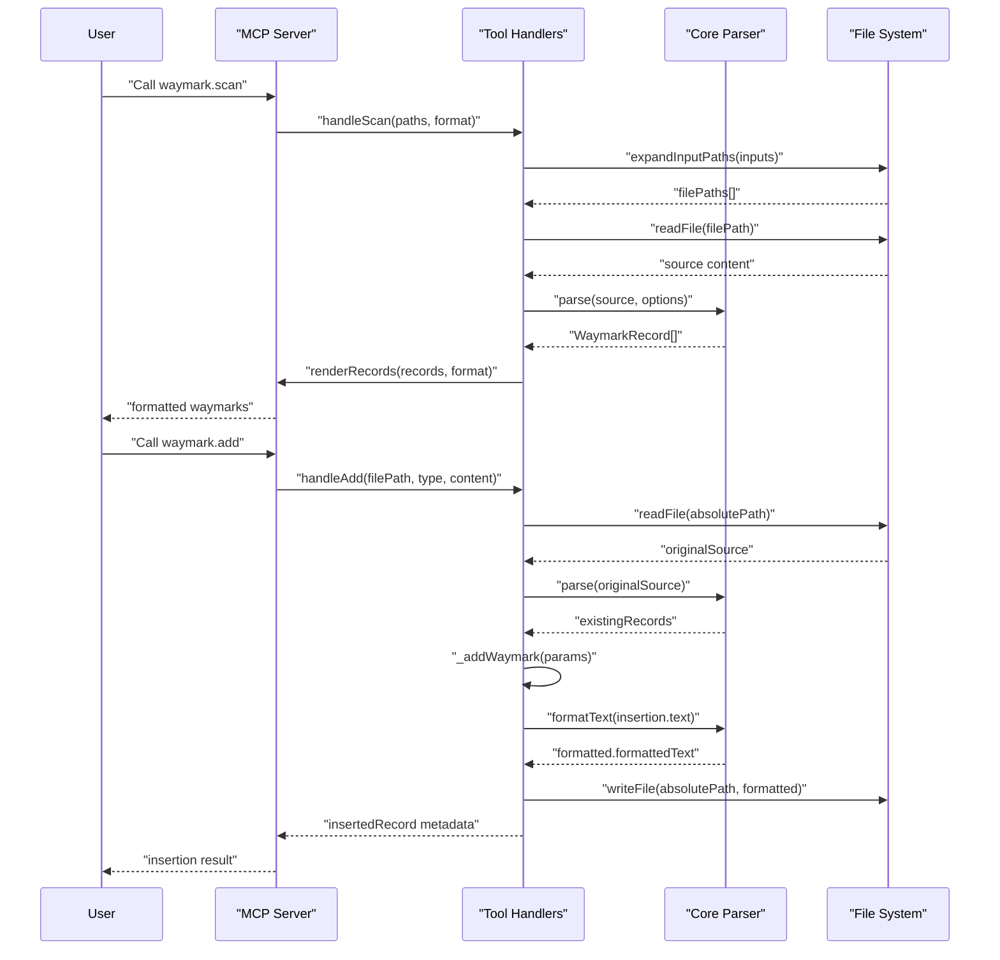

# PR #96: docs: clarify docstrings and line-comment policy

**Branch:** docs-clarify-docstrings-and-line-comment-policy  
**State:** open  
**Last Updated:** Dec 31, 2025 at 05:03 PM

## Comments (1)

### @[object Object] • Dec 29, 2025 at 10:46 PM

General

<h3>Greptile Summary</h3>

- Clarifies relationship between waymarks and docstrings, establishing waymarks as complementary to rather than replacements for API documentation
- Adds policy preferring line comments over block comments for waymarks, with block comments restricted to languages lacking line comment support

<h3>Important Files Changed</h3>

| Filename | Overview |
|----------|----------|
| README.md | Added section distinguishing waymarks from docstrings with examples and established line comment preference policy |
| docs/GRAMMAR.md | Added "Waymarks Are Not Docstrings" section and updated block comment restrictions with clear usage examples |

<h3>Confidence score: 5/5</h3>

- This PR is safe to merge with minimal risk
- Score reflects clear documentation improvements with no functional code changes
- No files require special attention - all changes are purely documentation clarifications

<h3>Sequence Diagram</h3>

---

## Reviews (0)

*No reviews*

## CI Checks (0)

*No CI checks*
