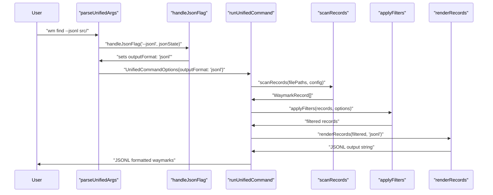

# PR #97: feat: support jsonl output in unified parser

**Branch:** feat-support-jsonl-output-in-unified-parser  
**State:** open  
**Last Updated:** Dec 31, 2025 at 05:03 PM

## Comments (4)

### @[object Object] • Dec 29, 2025 at 10:47 PM

General

<h4>Greetile Summary</h4>

- Adds JSONL (JSON Lines) output support to the unified parser pipeline by replacing the boolean `json` flag with a flexible `outputFormat` string enum supporting both "json" and "jsonl" formats
- Refactors complex parsing logic across multiple files by extracting large functions into smaller, focused utility functions for improved maintainability and testability
- Applies consistent documentation formatting improvements throughout markdown files by adding blank lines after headers and properly formatting code blocks with language specifiers

<h3>Important Files Changed</h3>

| Filename | Overview |
|----------|----------|
| packages/cli/src/commands/unified/types.ts | Updates UnifiedCommandOptions type to replace `json?: boolean` with `outputFormat?: "json" | "jsonl"` |
| packages/cli/src/commands/unified/index.ts | Implements JSONL output handling but contains redundant code paths and undefined fallback behavior in graph mode |
| packages/cli/src/commands/unified/flag-handlers.ts | Modifies JSON state type to support new output format options but may have type safety issues with null handling |
| packages/cli/src/utils/flags/json.ts | Refactors JSON flag handling to support both --json and --jsonl flags while maintaining backward compatibility |
| packages/cli/src/commands/unified/parser.ts | Updates parser state management for new output format system but references undefined outputFormat properties |

<h3>Confidence score: 3/5</h3>

- This PR introduces JSONL output support but has several implementation issues that could cause runtime errors
- Score lowered due to type safety concerns (null/undefined handling), redundant code paths in graph mode, and potential mismatches between types and implementation across multiple files
- Pay close attention to `packages/cli/src/commands/unified/index.ts` for redundant JSONL handling and undefined fallback behavior, and verify that all consuming code properly handles the new `outputFormat` structure

<h3>Sequence Diagram</h3>



---

### @[object Object] • Dec 31, 2025 at 04:07 PM

General

## PR Review Feedback Addressed

Implemented changes based on @greptile-apps review:

### ✅ Fixed Issues

1. **Redundant JSONL/default code paths** (`unified/index.ts:42`)
   - Added proper human-readable text output for graph mode: `file:line -[relation]-> canonical`
   - Previously both JSONL and default cases produced identical output

2. **Token splitting logic bug** (`wrapping.ts:350`)
   - Fixed `splitLongToken` to properly handle long tokens when `currentLine` has content
   - Now flushes current line before splitting, preventing overly long lines
   - Refactored `wrapTokens` to reduce cognitive complexity

3. **Style suggestion for nullish coalescing** (`query-parser.ts:106`)
   - Kept the `?? ""` pattern as TypeScript requires it for type safety (string indexing returns `string | undefined`)
   - Non-null assertions (`!`) are prohibited by Ultracite/Biome linter rules

### Files Changed

- `packages/cli/src/commands/unified/index.ts`
- `packages/cli/src/utils/display/formatters/wrapping.ts`

All quality gates pass: lint ✅ typecheck ✅ tests ✅

@coderabbitai review

---

### @[object Object] • Dec 31, 2025 at 04:07 PM

General

<!-- This is an auto-generated reply by CodeRabbit -->
@galligan Thank you for addressing the previous review feedback! I can see you've implemented fixes for:

1. ✅ Redundant code paths - added proper human-readable output for graph mode
2. ✅ Token splitting logic - fixed the bug to prevent overly long lines
3. ✅ Nullish coalescing - justified keeping the pattern for type safety

Great to see all quality gates passing. I'll review the changes now.

<details>
<summary>✅ Actions performed</summary>

Review triggered.

> Note: CodeRabbit is an incremental review system and does not re-review already reviewed commits. This command is applicable only when automatic reviews are paused.

</details>

---

### @[object Object] • Dec 31, 2025 at 04:10 PM

General

<!-- This is an auto-generated comment: summarize by coderabbit.ai -->
<!-- other_code_reviewer_warning_start -->

> [!NOTE]
>
> ## Other AI code review bot(s) detected
>
> CodeRabbit has detected other AI code review bot(s) in this pull request and will avoid duplicating their findings in the review comments. This may lead to a less comprehensive review.

<!-- other_code_reviewer_warning_end -->

<!-- walkthrough_start -->

<details>
<summary>📝 Walkthrough</summary>

## Walkthrough

This PR refactors CLI output format handling from a boolean `json` flag to an enumerated `outputFormat` supporting "json" and "jsonl", updates query parsing with modular tokenization, refactors line-wrapping logic to use stateful scanning, introduces helper utilities, and adjusts documentation formatting.

## Changes

| Cohort / File(s) | Summary |
|---|---|
| **Output Format Refactoring** <br> `packages/cli/src/commands/find.ts`, `packages/cli/src/commands/unified/flag-handlers.ts`, `packages/cli/src/commands/unified/index.ts`, `packages/cli/src/commands/unified/parser.ts`, `packages/cli/src/commands/unified/types.ts`, `packages/cli/src/utils/flags/json.ts` | Replaced boolean `json` option with enumerated `outputFormat: "json" \| "jsonl" \| null` across types, flag handlers, and command processing. Updated output handling in unified command to support both JSON and JSONL formats. |
| **Query Parser Refactoring** <br> `packages/cli/src/commands/unified/query-parser.ts` | Introduced new modular `parseQuery` function with dedicated `tokenize` and `applyToken` helpers to replace inline parsing logic; added property token handling via `applyPropertyToken`. |
| **Display Formatting** <br> `packages/cli/src/utils/display/formatters/wrapping.ts` | Major refactor of tokenization and wrapping logic: replaced ad-hoc token readers with unified `tokenize` flow using specialized `scanX` helpers (scanTag, scanMention, scanPropertyOrText, etc.); introduced `WrapState` and stateful processing to handle token splitting, line breaks, and width constraints. |
| **CLI Command Utilities** <br> `packages/cli/src/commands/modify.ts` | Added `isInputQuestion` helper function to encapsulate input-type detection logic; prefixed Interactive keypress buffer with default value when question is input type. |
| **Parser Modularization** <br> `packages/cli/src/commands/unified/parser.ts` | Refactored `buildOptions` to use modular `apply\*` helpers (applyOutputFormat, applyFilters, applyExclusions, applyDisplayOptions, etc.) instead of inline field-by-field assignments; renamed `jsonState` shape. |
| **Tests** <br> `packages/cli/src/index.test.ts` | Updated test expectations to use `outputFormat: "json" \| "jsonl"` instead of `json` flag; added tests for new output format detection. |
| **Documentation** <br> `.agents/plans/v1/PLAN.md`, `commands/waymark/apply.md`, `commands/waymark/init.md` | Applied formatting fixes to code fence blocks; reordered tool declarations and updated allowed-tools lists; removed Context Injection section from init documentation. |

## Estimated code review effort

🎯 4 (Complex) | ⏱️ ~50 minutes

## Possibly related PRs

- **outfitter-dev/waymark#51**: Directly overlaps with output format refactoring (json flag → outputFormat), modifies the same CLI parsing and type definitions, and updates related tests.
- **outfitter-dev/waymark#58**: Modifies line-wrapping implementation in `packages/cli/src/utils/display/formatters/wrapping.ts` and wrapping-related flags/options.
- **outfitter-dev/blz#201**: Addresses the same CLI output flag change at documentation and release automation level (replacing JSON/NDJSON terminology with format/jsonl).

</details>

<!-- walkthrough_end -->

<!-- pre_merge_checks_walkthrough_start -->

## Pre-merge checks and finishing touches

<details>
<summary>❌ Failed checks (1 warning)</summary>

|     Check name     | Status     | Explanation                                                                           | Resolution                                                                     |
| :----------------: | :--------- | :------------------------------------------------------------------------------------ | :----------------------------------------------------------------------------- |
| Docstring Coverage | ⚠️ Warning | Docstring coverage is 20.93% which is insufficient. The required threshold is 80.00%. | You can run `@coderabbitai generate docstrings` to improve docstring coverage. |

</details>
<details>
<summary>✅ Passed checks (2 passed)</summary>

|     Check name    | Status   | Explanation                                                                                                                                                                                |
| :---------------: | :------- | :----------------------------------------------------------------------------------------------------------------------------------------------------------------------------------------- |
| Description Check | ✅ Passed | Check skipped - CodeRabbit’s high-level summary is enabled.                                                                                                                                |
|    Title check    | ✅ Passed | The title accurately summarizes the main feature addition—adding JSONL output support to the unified parser—which is reflected throughout the changeset in output format handling updates. |

</details>

<!-- pre_merge_checks_walkthrough_end -->

<!-- finishing_touch_checkbox_start -->

<details>
<summary>✨ Finishing touches</summary>

- [ ] <!-- {"checkboxId": "7962f53c-55bc-4827-bfbf-6a18da830691"} --> 📝 Generate docstrings

<details>
<summary>🧪 Generate unit tests (beta)</summary>

- [ ] <!-- {"checkboxId": "f47ac10b-58cc-4372-a567-0e02b2c3d479", "radioGroupId": "utg-output-choice-group-3702901381"} -->   Create PR with unit tests
- [ ] <!-- {"checkboxId": "07f1e7d6-8a8e-4e23-9900-8731c2c87f58", "radioGroupId": "utg-output-choice-group-3702901381"} -->   Post copyable unit tests in a comment
- [ ] <!-- {"checkboxId": "6ba7b810-9dad-11d1-80b4-00c04fd430c8", "radioGroupId": "utg-output-choice-group-3702901381"} -->   Commit unit tests in branch `feat-support-jsonl-output-in-unified-parser`

</details>

</details>

<!-- finishing_touch_checkbox_end -->

<!-- tips_start -->

---

<sub>Comment `@coderabbitai help` to get the list of available commands and usage tips.</sub>

<!-- tips_end -->

<!-- internal state start -->

<!-- DwQgtGAEAqAWCWBnSTIEMB26CuAXA9mAOYCmGJATmriQCaQDG+Ats2bgFyQAOFk+AIwBWJBrngA3EsgEBPRvlqU0AgfFwA6NPEgQAfACgjoCEYDEZyAAUASpETZWaCrKPR1AGxJcAZiWpcDtzc+BS4kEKI+Bge/HjceChY2BjwPvB0PM6IlJAAFLaQZgCcAOwAlJCQBgCCeLChXERoHh7wzVjVAMr42BQMJJACVBgMsL7+uGBBIWFgkdEeYL24CVPwGGApaRm0YNzZudXQzqThw5hjXLT4DIhgDB7OabJgN3e4FBtE95h7beQHiw2BgpiE2gx5N1cNRsIguPhuGQqgYAMIUSaZAKQABMAAYcQBWMAARhxYAAzHjoASOCSKXTigAtFEAVRsABkuLBcKt4QB6flEdSwbACDRMZj8lbpXmUN4kCT8gDuaFkzGcAGt+QlWvyykYACLSBhfbjiaIcAxQGq0WjIABSXQA8gA5DlxVaJGahcIESC4WCDbbpTIHCg5PjceBIgEkDTWmDScQYIhcV34cIUFL5DCZyAYgCO2GTdHKCYMADF4F5kGNMKR6Hk0MgMbMaPQNgpWOxEOUrVADgxNWhSIh+Y94PzEP0J8C/uOQ7t+RslAAPDS4RCJocjscTtrT2d4Gvj2hIbhPWT8nyhDVyiMqqjBb6b7e1VqQYstdTyZo0VsSHbLFkAORBEG+LgAVwAAaANZCRMZRE1OCAK3CsLEgVFgV7exHA1FwjCgABxZ8EBoacYWHb5IFVChUlTLg4EGQpUDzcI2AoUgVC8SAJHgNBIGI9QAAkxSGUQ0DhQZBJuZUMEQKjNWsOxUERMgNEgGpIDaRT+B8AsSCeDsVOQLtA0GRS0GHFBQIofB+KUJszBJek4Jcsl3NckkvJJPEvLxYoAoADgC0oAoANgCwkAoAFgCikApxAKfKKPz/KKYogsy0LMvCzKosyxLMuSyANQ2cshOweBaEuQZ/U40gAyDewlP4LBSLQbhyJkjB6EEgFlP9TruvUQZ3jMszRg8bAnIrG16lCfJmladpMEqNtfWQNA7QxcCaN4eAloxfiSGVSA/DoARrOUnx7OYQzTuVXIAAEiDbcQvDALruGQZURWawZb1afB/tTC74DXaQrSqElNJsOgUlq0FICdN0OX5JQfCkjxwiYJQskDKbICXOgVz6kgNy3Lgdqcnh7KRPhRQ1TYMR2nj6sp8IVjWC6lverrYDKxRBnMlq802NH3UJoW8lvCh7y4AADdIvA4ONdAAbQxYyjowABdMA9EYTBongBgWiV8o4PSNcDq+JbaGwS9zeoPWJNwZ7kSlj0/kgLGce5+I8EQBMqhxTToHwTVkUQF3eRogRsCIJJaOfaNUzfXxIcyOO2lwDloiIKOY6wf0fBmxAhYYPoMRRjWBBIeXLPjlMU48IuA2jsg/qDLAa4oOuC42QZYBbBRQXYABuQzsbEUJMmVZ8S57rvDKdgYFCIVJxCkbtL0p38w8gClNNdbBVqrhQWhNGjFNkXiu2LShXnDSMs8MmER/oCzICVgB+f+kAABEwClaExoPRPmfBcAIUsmgPwsD8jQDgV0U0MZwiKS+ODVch9wYWywBiXAfRkgU3SOQWg5QZ4SzABgC+sQWyRgtApfISsQBW39kgFoHdnr0DkPTfAIgxA6Q2JAgsF9pDzUgF0GExDkDO1qgBLgNRPzfnzn+ag0gsj7XBnkaCkBACg5KhOBSEbJGIDMmZABjKp1EDMdEgz9FLIBevjZQqh1DaEehkZUUjbEsE0fQbCSgbAqDUFmICHh5A3TzMqLwtAxyMDHqmLRft2JaPULRGssQTreJnhsR4s0tGBmoFhEWIT3HhFQJgJIpoSAghhNkxU3j7CyEUnU9AfV0BeLOrRcenx2ikAxLQDClhsKsAyWwcCo4tEOCcIRNEwJ1BTQKUoAcF1JiBGdu2CIUQYiel5l2Um9A365EACgESRPiKGwAMR0LppY829Fs30CYoC2y4BiZgDlxrOwhJowyUQPBSCsPdc0NQBC+guikMQ7tzkfK+cgJ2LsLY0EgEGDwjMXkQzXDTXa0hkCFByT0y6tBro2TuiwSA70gKfRIN9YIyBznwGYAfepyBf6EvOrbaG6A7SoscJgMAbNaoCF4gLbqYBPkEweeEPINCfbWx5UIOEuB+TPxcPsQ4fA6GXyFkk2gAIiA20hjpTuBBS72FbjRZUfdGC13YByEeqLx5MEnqCOCfsMRzwIHwJeXUV4sPlowJ4XxYEVmwt9RaEYEDcEgGkrgxEyDKBMv9QMWEniFNKUoGe4bbENCGWAAAQvIDWvBpDsHmkbYw4AoBkHoPgAyUkCDEETVQEykp6lcF4PwYQohd5aP4a4qgFStA6H0AYEwUA4CoCqVgRthBSDkFbZkdt7B3loHOrMgi8gB0iyHWEkduhK1VtMAYLQC6tw6ieApfkEgST8isByGoroNDMFoFaUBwCDCYRqAASWbYugJeE5nyHrYkhs0gjDOhiFE6B9425geSanB9T6X1vsBkG/AEF8Ei3WaMXqP8WobCYZkK9RBsDTItaIJ1e9G7Ih2kqtp9ByUPWqSkJ4jc4k3jIAMPhHcbL+kEkrITNA1y4CE0rMA7GjKZBFbcFC6BcaUBog0c6v8ACyWo5KENrZQXInxJhspatxjuOR6AupoKCM++BIWjGYS0BQSg4Id2FAwOClB7JMz+AauCS1zP2ViBXUGCGxwVgAKKKSZYB1x3TzpN3lpwSAhdlQGA/URE97aFwqjVARbUP1ImoffaAr9lhf3/qTbnfCzgQMGXrMk98qIkmNnQ9w0GdAwAEHwB4BFohg1u2iBde6XSMvTCAs4QDoQlBDJEXpWtVqAYFpbLAPIypmAcAAFSVAE4ZCbun6C6XCCmoWC2q7LdWxt9AhmgbwAjOEdgLhNIqNiB1rrhlypYFLTkUEM9f6CEjBIDmnCfB+DrpvVAv9nv2BINzCgk2On0EpkijJ71egZ0NTwTM7ABKtCiUD3tNEId7U6yefrh1Qi/n9n0GiojlDQr3nCaZFZzAlcU62vWbLrO/yUI8MbzDkCgYR76TIS0EgivNpATH4gIOJgzOLtcwE61RjFBCLSVgf32HaBgWEe1aK6eFueUMwyjDhfEPeZdOGOXi6B76Lgam6DwEcClor1p0vzj6uOVU6otTk3UAVx3n7v1/oXeV+gm6qv6WC1LqArJuCKKxCDXh7X8CdeQMxob84RvhkA/ttegkMQ7am37RAbQiA8kibLg4FM9tIFgsF/HLUcjcwMs95AAvTNw8Btd/gMPKCYoRp8qQBHBjYUnqJyAP6MBCOYZD6F/XmydKWbLtAzLeJxj7ANilv83v+1uI4dgfWMC94idZLEGGsMp2i34PDQw+PKRy7kVP4m17iZE5U2d9hUjBCh+6lndegbcbNwTLJjZKRuRk1AgJZomLaHTNUlzFQNfpgMpBrAgmIoJDkDPlgEGDtLkGLCxFevyKFlDDXFPqHi4OgGzO6rjtCuDPLHBjRIXkOK+ImGphsEtDQdQPBvRsqqyqnL/FYFepAGpjhn7F0JVqQWgbznBPkjNOePgo1kUtZq4mAEAYgQ2KAaPKIttJ0g4IPL0H1HfAwZnEYEYVABmOQOOjUByNAKFjYDUNAD+m6F0AAPpWCsgFocg/qoiOGhauh2F2GhZdDGzS7RAkDjr8gWFWE2F2EOHOGuHuGeHeG+E/r+GGAGDG6RZtrm5NI9JxbW4CF24O6pbO5gBGC7jTLjiThHgMBzhOBu43irhZx+7FZaSB4tqAYkHVYR7vhQAIyXjH6D48BK5i6IhT4LAYD/xcDgqdb+BYCHZdLkDnQi7K7DHuzSqVh3jUDjEgKjHAKQAAA+WxuyHgOxXY1YfUYyLMtAzo5obOmk0ese/UXEu+KMb8+O1mIQuofyqx6x4Qqev8oxF0TwKcVkNA7qnSnBjG/A1x/WLqWC1yU+/oUhGaXxCsJSiw8g1qscUO8MdSXy9A54GIwi/xoYHg9A9OTUXY2MEgS0oGgknyGI5eEIGSyJ94EMRktAcEH2lA/E4Mh8EW4MjcY8/ES0GJZcLUFco4tkAijkMmiQOsaAdsOCfo1mPoYQAYyo1mbB6ERhkBLOYYgxDA8ESIkApxtA5xfwVxvO7yOJA+Oy0QmxkxXg1SfstMQuwcuAaxKJuAmxwC2xexBxiwwCtxMeUWOGDUXUtpWA4pQJsi9UHO4sPSzJJSxJeJlO4Myx/WjCdSIqsgUidxgGJyJpNQXEKePCa8Gw6gWO8AAAXoMKMTIn8uPNUoIJPpkqmomTXn7P6C6ueHZtjhdhBNvJCbzhoO2bRDanWTGSOW6R6SyagA3jPHCjafib2hGf2RrvUjwUZswOoCZOmQpFIswXmD6tdjRLVgkj3H0PVGPH6HAogKhKOHeWVJjtEI+X7KrCQFYNQNXNECmCWGvO8RfH8hZJ3ntIhH2qySSY+UnNzNBvsngDOSUqgN2RWdENwvILwIiKOAEiMlpCzvvuzuhlzr1rzuHgLmEELorqLgaRLhkF0XkXYiHhrlrsGMGR2MrCaWaX1BaWzuAl2ErKUfuBUTOFURlrUeQsMluErDDLoJAAWk3AvMrKMfaUno6RgErAYFUDaD4JAsrO2d6b6fsT6YcWAkzgIZgGkMmMaTWIMDUJrpEjWRQEbhFqbmZpkU9JbvFjbvkcwI0UUSUTdGUQeFOMJdURceOJKi8A0algHmVkuiHqIR0WeZHpAD0U8DxkkBrLCWIH0PZqYrdEtBsLzI4iRbMbJHbsipkGiozLZOPmsAAIolgRbRB5DFV6wKp+yiL2QbyZC/xVX35QrwnWZKCQLbnkAoANqUqSDIgYXMrhCtX9ZqRN5wIgKFV4CBmJipV9GcIEmv4ayKgtDkZT6ga/zzUH6wJGkAC8V1K1GAawOxsxSAtVeADVyYesLVjVzClQOBAis1MiQEkOxC3AmKwKTcOc/R4+kC1k4FMcCEe0yAwJgwScuOx5qanOTcgcfEB1gwIp6GM15oX4H17sM6SQvM51JAcEcINEZwxo2MF8uAAAaljTUIgDItgkQO9a9dEFQvwBZBQP9DkKhC1EjcDq1M4FuOLrNTmZAXaCfvMTVbdc9YTf1j4ANe7P6Nxl1A4MZFeaLArVMGTf7FDnjv1s5mLnkIir8iZL0QMBub9lyZkF2PrjVj+VzG5pQX2mXp1VcgwL/qikZNVYGhiNJOWNqd+nhSRf6Gjdzqzi+aRXLoLgrgMVReLqCBWclaYSEakc5SGQTBbjkWEF5eeAUU7hAMUQYAJdIEFZUaFZlkcjeICWAHql4BGFFUVjFUHnFUBluuHklXRcxNYIcPWSiosWLgbQopopdhGUPVdmyevixlgM2SuaVUMCpdMauRhYzEggJgvT2sIqVQvdOd8QIpvfIMUnjNUo3P6RgMAnBEZQGT5lqvQpHAgHWHIcgCpuhtFm2HtLhH7DCbvpPf8dKrBtQHBG2GlXQersvojavdUlGa2ULDAXLoybdnQswJJvADHK1GzZjTNPhrGk/aHczpDRHXGeND1jzmznHfLl3kncrjRclSgkaUlWhkrJ+RGCQNPbxVgPxQFYJYeCFaJfaPyHXVGY3V5pQKHJJSiJpbJfJRiIpbstPVwAAN4RkTGwNYAAC+4C1QsjNQ2llAij0QyjkAaj7ZXAd919fpVjRxfp2qsQOjplGmqQfgek1YvEtlLQsgDlTlJuOdgwedVuBdeRRdPlhRpd/lw4gVQls4Qji4rjy4uCVM8IjR7drRJk7RPdb9REKVR+6Ve5EF9AmubAc9q5/oo5XY2YGArIiTdAnFxyY2bAYiSgWVxCbNmKI0QskqgwwDTdNE49bFGlMlINQpcIZeaJ69X5+Q/EgkRJgJG0UOJCmQUs1CQW0kfOh9npkAV1F1V961+jMt8VwQEKgatjOx0qYDSz9ENE8xcYCobQ25JkUsPAuQdApAx8NoRzhttNuMfKLMgq/gwqvEL+cFPx/MZEeu5NIDCcPJ8SKSyAwCzG6sjqYA2sRk++hsxsBAqIpsqQFsRxmKaCmAdRLOoE0zfTXmAzrFdA0l3R+TYYOSvQyA/xBwqaeQszq5UZlQy9HdQxWz94ShLYYYX5nzkAAA6japU3ZA5DVHQFcxTBQAjEwDDpNEkFSTHPQLMWfTC+3r/KrJApkASRNttPSUQss/1B3KmBBATD9m6Zis6FIFQJ+AKWgEKXwFXGkD8YNmI7QF8FIFgHkKMZthqd8W8P68iHkO2ZUNKq+e7YnJmELGKog1oQQlC6HEERHmvF8s6wFqrf1iU703wOa1AmTTPCPQaTUKrq9toApHBNBSTd6GPEaWPK/eBobkYWHSQ1Q5HS1ERZQ7HfzvHeRYnRWyneIJLnRbbgxertvMxSTDS6w9U7UzsPU67rQFG1CQpFwCuwbg09xS+XBOZlzFwA08Pi/uUOAjEhPLMlokrLu7sPu1u4gOArMcmX/O2dw20jtOHkrKMeAnkF2BXeUQI3E+uwk6u7QOTOuG+JVP3WOyrbZu7AOZru04E3UrW5PYgEvtCw27/KtdzFu7Gjh06m28kkxoNn+7suAv6ErJ+zhS4xZe49ZVpHZT45QH4+kQAeh+5fnQlrbmE75ZE+XXw5XbEyJeByI3U1BychQK3f7iVi0QBpkwldk+BnRQjIW+3m2H0CEDkOhi88A3HFRkB4cKLTQFwBOX8iw2U2o6MRo1MdUlo2vOYwK9iJgPIPsQ45AFo5iuPkMNVCSQe3W69l8hlY6ozGAO+4wuub/fPgpDQD+xsBqzJADeHnLZKoBXwHlrIGtn7eipI/+YiIBSinuak7Izl86G57gHkAjT5s+5UA3nzs+1OV6O6UfTjQjRoFZzQK12sAhZUnZGWhARV8EJEh45AogLVzGfV7zpUEwNGEUrefeT8HBPUmzmA9oKZqCSHjCIPIvDaljN/PyDQnUuaFLaN5eLIAQQUhBC+dN5orN2zvN4iLRbLisiQEw9IG5muB9ycKt+99ISQLbqnbHTjad5LWKzl4aBeFeMF1N3V0Oc9woItwirD2qIIQTDjUdxQlD2N7IOe1zPDw9yCUjy+S96jxPC/kWboeyVT1zHJc3Eey7aJgY2Itj6Dbj8M1ADl6RCjt8MT4j2VxT298js7EWnBFEGEBL49JI9jYd5z2TJ8CWHj1d5+cKKh3rILzN2TwpCL1oo8+oByRRhz+QnQIfv3jrfwCSflwHfmywjF9vD+j4DTd/O3o7xgM76YaFpLe3tuQLCitwiai5mvL/HLTl3l31S3YmP50nDWJcc+5IaCF1dcoMP4BQGXiW7OoY9l/j77XLVH4+ZyRQNySnPqxsPZmV92i2TCcr+gX5/3GzDQOwzkNPUnxWT+DWVPTGQg2Y2CwN1wN5850Rol3Wk3i1KWmM/Dc2/GJBk69wjbPbz+EgqgMXzaQ25bxRxShsBrMmUoa8NF/tNvNwQ1FcsGugPj2AJHxIxGDtwZ3ctKG6TC/BgjZKXXDh/1AwCqzIUQPlkQ7hd21jq9tyG0dfCtQwTq0Mx2DDOisCnUhhB5ALDZWC304aTkeuJAcBIACTCewDPwXb3EymSsOzrsgc6qUfONHazAQP77fEaYGATzgQ0/A6N8gfsMkixTwHWRv+3wT2jwzj5Bdn2VsCsDLjlpkUOwOofUjZnQJ84PWTFNDn9F1wulE6i5OgDPEmbU56I9mQvjrjNbo154BeTpLwUHo98q4XUbGuPEGZYgv+E2DgVLSzr+MMiudLIrFmCb8dvKQnE9MByrqCNJOddNVK/E1TycmipWDum0VU6gZe6uTCGin3SqCQ5aJyF6qQUQ7oFmoqJfoEGCwQT0sgEYROKfW7ipAqyvtAju7zz7gwzUq8f0NwP6gD0OGtAWISBl3oHYAYAFbWj/GW5PlQeIXGEADw3qUBJ2P3W7htz1ZcxoAlAZgBm3pbW0HaMQCLtkBoim0DSy9TLufx+j2RrI4wLuKXGrIkAOaLgRZu0wd6zpB4aocPNUP9R38cu/qPIMUIwBXMtauASoKYMnrICqhJYUgmwIsGpg/+XzOmP02oLC4GYXQrIaXGQCcsyq54Cqv1Hx6wCT6Zw/7HgyuF01KgUfNzJrlFzgwYaHAaEX+T9iojcGf5HICzHEB3Ak+KyBNo53ew/0r84PazOiNFgytpShueluqQoCat0MFw9YXwFETWZUCMZFWh4El5GQfAQIUELWwdrQN6k++OlqsLIDrDNhsgbYSQk0JkEqAHRI4dkLFZdBRsS6W3oV0DTFgMcTqPqAanyB1J1ADVDHLQH9QKprUY0OOMfj1H6oaIeQJuiQElZWihwJAdqp0nIT2YLhEtJAHd0DYVw4QsAU4i0GOEAlAxqIO1KCHNFisfevo92DMMNFPNzRsaILNzn2ihhWw66bBt8Cmjq1fulcPWByV+HwC1uz5S4QGFHDGIkQD9CxKPguEZtZGJokyPWLIJp8nmJkPpFzAlEsJZiOokyFQHOhUiGxMlYMU9myE+j9oGZcwSkHFqBooUJmTIH2P7TyAjRsLFOIJFBbejA0J1bAKaPp4owloueEgGRnP7ejE2lAfmrPygDhDva4wyBHZRJifRyc8QkituPHFGjJxs6LQj30+CYAIIJVEUCsFrzgxpIFAKLtZBohCCZAJAWQNEH6h2gDohwaoRdi6Rjsq2P6TFBplERCj4cdsPkinEUScjsw2VbXIGgeHIS/Yyo81A2z2h180O/RF4tQVLKlDBgdJViWf2cD9CrIIqWfv4PDo9syGhtUASRSHY0Nhcog6AbkygKZAhBmQF8XrGVhCCxBU+GIU8NkDSjAg/SVMP2AqGmZqh3DP+G4PE411aiXgtSRqg4ZydJKzjcym43CAeMbKbHXxhE1cGicQOwVMDjUWEZ10yaUjVJtFUU6xUghwGNTnViMCbV0qv8Qzk/3gbL05ao5Pcs/UGCT8jocICMspRJFv9rSWITpOAy2qzE9KljAylfSOJHtGsymILMA01KSljOPtA3GU0EgOk16iAFNGMBzxYAyAu+TulghohUjn6VSd2oCJ/CKJ3YfsLTFgn8APQvhKcDEvSUamaNEkyEWXNXnlYpjzoRYaqDgxUGlpZEKxcfpZGkxiBc4WkogFZh5pBg+AyZCQcHzFzOBYy1yIMB21ybTsGgUHLoFIMvIR4uA/nXhtE34YeSJOXkiDgbn5C+S3wSsOCPe2k5PtecV7ILIiVaYftqu+lXZDsUMqjEji4CVJNZitaDIakQPZAFRztLEDpiSsMLNnVsE8dmkfHQuvbnCYl1XJf0sTqByqLJNNwyYPwek2U4VYQpIQnJjH2T63if4liaBLGgTIxSj6w1Y2lgG+pHJuwFxTtIcAfZ0AiyPwNaYZCYDbx1h9ACAP8T9i6zDi7eBvJQO2YvCYclgw/GMJDyKhlAT2Sysl1uBgCdWKU5lmXmkjlD5mEpOKeLLa4DcimhojQKdJ8zVcipqM2huc0qDWR7I4EEmNJ3lmdlLE3+SBKeSD7/iUknSBHL2hFaVD/kdNEYWZWwlEZ7ALANPnhPgxoRDMJSHWCBjfyeyU4XYBptgUngB93YsqBQiwAPgopFylfAyKMSFZt48qfYetokBVbBg45QjCxE4nVnVz2oJs2cglyBbh5RiDrefp+D8ydYASQWD5Jh3QzYdSmc48eeuxliIBvsLUO2iXwBxJVJSH9KqUfTnKIRIO7eDelhWbGwB7IycIWCcmVm0BVZmhegMu2hlHzOWYfH2f1yPrJlGcOpQASwmAFCTiKVDUSRAPEnJ1JJiYd6XOzQ64CAk30yMixyMksyTJ3k6TqDNvL5Ax2KgueIMG/kwznu7qO0OKMKn7MbGGMz9LIz7xhdHYtKM7q23WEkxsOTUUDEpRJmYBcmGYCzjABfqzwvAYgSeufP+w8TJ5eMN+okNuxy4VyZXPrvBSPrYyTUySYtkZBrm69Q4RJJaL/DllCMKwwANoHoEY52SrKnjJyZQGAD8hrFnHFyg5ipnZFHBtM4up+j8oicmZ7k6uieC6yYx0e14TUpNyfA/RXw1MNJoFMCEqdeZNWfmaMLSpYg9gDQA0t6KFRajTFD5Usa0KL7FjuhY5F0cfjv6gtl6cslkV30CyqZryhtLwP+HkLmpak++NeLVMrI1kQ8BCAABrKSqGtXAhP90l4EIQezCMZZgAhF/DnQFAQYaJimUYBnRAEV0UsrNJLKFluAGwCkEjlgkiAVKFpYBGuG5iORMAbIZrH1gN9Lk3VcoXLWJYYAEY1ww0vg1QJQ5w8PCSTDbNiCIA026g/0BhW6pdJ/UereMqPmSZXNra9sJpMy0hyZ4UUwCBGDtB2JZ9sBRg/OT+hFHsAT8gQtoD0vsAEJF0PAGMEZBHhcBalGw49qCFuE5BtoYGLsKBl+WYABlBLF7ACoiGxkARscz6OhlrQ90XaEBNJVtU6yTYk+JaEpdeCpHpCz8vfVAgQhmXwDGaeDJ8rViQDz1yhTkV2JkwIRNi6ASqv8oGmmkE09xPU61pbPSX0BmAdNGMI/ABT5kph4MdQXkCFQKrYEAAaRglXMdouq2gK6tkD6roWQqWpkuN9USqA1Xqs0QMOyFuZcADADQDywBgwlOsNUNooSoGZPjJ2+QJlRgD9VzKtlSylZdIDWUErMAWynZeWKhxxq9ldynpNmudG8QQlR8AWTctT41rzovqF8ODARrciBENyGVT0w8BcBxWz4aevkFXxHtIxw8cgNWq6SOiug8cEFVHzXgBir4fsRqC3HzgDZRw3BdkRDAfGr5D8XqBeFq2XjZDkACY/0NJC6TdqL4F/DCssMhUQMihE/JlmlPmHOA4INCG9WOPNQdrUcsq9XG8NpRgR4aPfDUGMEdQ6tHR8NS1ODFxndjXyn+PQkULPVrxx17eZCr2SGBsxNQ+c6ScUx6TrzYghfQIA0Avi0AC0OGxngvCNlkaSSlG/wJqDZ6UB51No/0FLIViOphgjGyEu2G2CZrrobefrN6INqF5a4tPV4gCMPwMimRuMxPOajzg7l7RimguEXGTH+hUVREuEp9PMy1saIVq3GDasGDoajxb2UVe7wBISly4lcIWL/AHhDwRE5ARETxDoJf8cqKKanC3P6zat68XI29X+poj1LzVW1H6LWhBUJjSqSGs0dkKjgOoxqXZDuXgCt4hALM4gezOQFHwawcaoW5DeuO7F6shqogOVuNS6SZU6NfCZKYGJkzCs60MxGqKmlr5UANCmE2tl/AoRpwuohPFGK63daiyzusCE7vgGHXhkLYtK4eeEHBKvzda94+zGy1s0akSAPVeMqpmyHVkOlfsALeDGjCxgR4RLfTKmAsjtaDaOPFCiwn4Re0N4tzHpL5PyDDbuAbfaRAQieVwj28gzKnJPFUF5skO/WFDsxQIqeppFfoZbSWowAMQiA0SzteuOSFjQSJvErtkmgEmEUKGMdFhIgpHaQCJJqdSdqIuCJJS5p9JPMJ0VD714Pp2uNHcIKgFY63uy2Z8F1vCRvYW8w7ZNADF/h7zLIpOkgDPDu3D50gKcbeUXNkmUIzpggpnT1VIWsF7eprabRys7Bv4PcKihTJNzoZi50J5MmwdxxiweVciIkdoLABcFl18FAMkRp9HHBRlxwy8uJQFOaJBSkl3dPmepyknfMohPSKrr7KPoG08gVjNGSVOAQh0hVkUifqIIdC7JKwgJUdZ0PgHqMV6mUgqSHMgCu6wF2zLzoQyjyLtbRXgYPdEFD1WbrMxrLWV33BSpoDZGZTpMXpiDijneh6f4qgFvBIxeRmCScqOT2Ze7tO1zMuNmFn6yNK9Ze2IDXtp717zO8YJvT7tb07CAwHesVpXvIAih78gJSUveCQh09UV2MLrLxNMoqJoFBFKOvAsHYGRBdGOlBVTuSr4byVy1BPVou2bN7ip5zVOO+SyCBL3Bx4E3fXQfL8gLd24VPfcVP1GlM9GAbPUQFHUUk8Fbkx/VURCWm7AS5u3ZG+G55z1VGUepqU51gMEB4DFjePdV3sb0IfOuTPMmxUGX9ZHRv+//ecOyGaScG+xJGIrzp4I0uARBsPTGR0mIGZZuC3iIbuCXP6zdb+6A1uFgNyVBSR0PgL3U6XvKuuo5QTULiwBl7aGPe0fSQnQDmDzZbw2QOW1fVF4okcoWaj1WVLvK5muySzadLcUBNNdNM0JnTJcEpEJ0KdMfjgCbSJKzcPYUEGug3Sqcd0k2UJD7k8RjpLD7adQI4RqiIBHCHKOgI4Ssiqkx046atLiH8B4hYoAgPEBSBJClBigOIEkMUApAkABAOIWI4trQCEhSgcRikESGKB+QSAOICKCQApAMABAh6Cw5EZ8O4A/D9oQI/YOCN8qvDkR0tI4XXWOFB5IRvbuEHCMqNhmwCJALYALQ3412Dh3AFYEwwdhgEvgFoALWGNVxeg9Gm/LYHmMXRFj5NYY0gEdbuYaoSga+gsdX0wRhj54WgOWsNC3BWaOYhrMhE2PK8djVQYBBcfLXuBcAXge48OEeMd6zjLxt4ykGNC/KzQzCb45qE2Mr6ljLxwaHQB/TgRGqrNTY6An+MgIngikcE89txiIBNjmsYZlUCGNVAiTICPKq6Bw7IngT6CIjuCZvr4miTwCYEnCF+MlhUTxJ4BAjivT75kT4J+wJqBjBIgdZmaEgOUjCSABMAnfq66vlUgH5ap1QBkAOYwyWk8SZeM9NkTdEMHUqeVPAIycGvFoOCbJNsBkTrTKk8wlYVEmtGrJsxnSZeOknyTljD47xDyqam2TjJnE+Sr+PWmQEHJzAFyftMtQJ2vENge5oMVd1ngNZSelvj8DztaYp205DGfBg+wwWeEE5qqVgVyzZOpyS0W1NQAA6s5BGd+SXiAl2a367yhlRLO2ZGq7hGgZ0/SdVOWN1T3wGsy8eNYYBedl5SE9sctMvGdTFfDwPqbtMgIAzJAM01UAtN0nCTWp204acsbXGPgODbCPP1IBNmQErpjs6cc9PsnkGPp00zOduCmrz8ObCjKgHxAaA0jAAUjKXZmpoDgIHObAyCWYJF6HYsNdiW17QGgNvVAMFDxAaA8QeIM89Wa7MgJCcM0HcyAgACavQE2IQhzBKwXEu6dw1/EpQZNxoe5k6S+zLLMp7Ie8CaCdIUCLn4wy54BHWZAQNnUwhFns3ZX7PTmQEOFtmjibpNaNhm+sVE8AnRPTGbAlJ0E3rGRNpHSgwUL/sFBxAMBCQaACkMFApA+BYoxQCKMFEJA+BSgFIAQFSCygkgIoQOUoGgFKB5HrofkUlP4CSMMAhLeIUoPSGKAIIcQtUPEAwFiianWLLYdiw6eHOWMfAglnwL+ZxACABgOIYKBFFoDFBCQtAUoLQAiixQqQqlrKMUAYCqWZLxQbGEFeCi0BCQAgYoMFCCuxQfAwlgQBFEiuqBaAqR4KAIDyO0BbLtF74AueUCkAIalAOytPU2MTmXjbBjwUDLqJ9Q3wdVjcwQAaSVhJdmxnyBufkkvlxWIoWc/ubdOQASQDFy08AkaueSwqUnSDtB0phtXVGHVzMC0G6vfaFIvVwC0i0l1DXAwI1tC71cmt0nprIB4yfE3msgzZOy1q08qcHNrWPAG18QZsaCj9W9rw11C3Rc2M4gTrbJma4DLmsRUfAOZLcO1fuvAJOr61nq1wESjvXNriAfa7AEOvfWuAeIP6/SYBuELgZy4bwRZPfhg2VrENqG09ZhuQA3rENgawpCRso2cxP1jGw1fOsELwDL+n4FweiC3X6r9Jkm89d5zbX4b4gmm19bptcAJrxJsc/9aZtG6Wb54POGqBvDfEolm206YTbutamebZN1IztapuI3Prc5kW7iAYvDNGLjFiIxAHpgkAujlAUgD0aDDDgAjbRo2EAA -->

<!-- internal state end -->

---

## Reviews (8)

### @[object Object] • Dec 29, 2025 at 10:47 PM • commented

**logic:** potential logic bug - returns null when currentLine has content, preventing token splitting. Should long tokens be forcibly split even when the current line already has content?

<details><summary>Prompt To Fix With AI</summary>

`````markdown
This is a comment left during a code review.
Path: packages/cli/src/utils/display/formatters/wrapping.ts
Line: 343:350

Comment:
**logic:** potential logic bug - returns null when currentLine has content, preventing token splitting. Should long tokens be forcibly split even when the current line already has content?

How can I resolve this? If you propose a fix, please make it concise.
`````

</details>

---

### @[object Object] • Dec 29, 2025 at 10:47 PM • commented

**logic:** The JSONL and default fallback paths are identical - this creates redundant code with no functional difference

<details><summary>Prompt To Fix With AI</summary>

`````markdown
This is a comment left during a code review.
Path: packages/cli/src/commands/unified/index.ts
Line: 39:42

Comment:
**logic:** The JSONL and default fallback paths are identical - this creates redundant code with no functional difference

How can I resolve this? If you propose a fix, please make it concise.
`````

</details>

---

### @[object Object] • Dec 29, 2025 at 10:47 PM • commented

**style:** unnecessary nullish coalescing - `query[i]` will never be undefined within the while loop bounds

```suggestion
    const char = query[i];
```

<sub>Note: If this suggestion doesn't match your team's coding style, reply to this and let me know. I'll remember it for next time!</sub>

<details><summary>Prompt To Fix With AI</summary>

`````markdown
This is a comment left during a code review.
Path: packages/cli/src/commands/unified/query-parser.ts
Line: 106:106

Comment:
**style:** unnecessary nullish coalescing - `query[i]` will never be undefined within the while loop bounds

```suggestion
    const char = query[i];
```

<sub>Note: If this suggestion doesn't match your team's coding style, reply to this and let me know. I'll remember it for next time!</sub>

How can I resolve this? If you propose a fix, please make it concise.
`````

</details>

---

### @[object Object] • Dec 29, 2025 at 10:47 PM • commented

<details open><summary><h3>Additional Comments (2)</h3></summary>

1. `packages/cli/src/commands/find.ts`, line 64 ([link](/outfitter-dev/waymark/blob/e09f981ff208e0df142289fdca284f5d3469548e/packages/cli/src/commands/find.ts#L64))

   **logic:** The `handleJsonFlag` function needs to be updated to work with the new `outputFormat` structure instead of the old boolean `json` property. Has the `handleJsonFlag` function been updated to populate `outputFormat` correctly?

2. `packages/cli/src/commands/unified/query-parser.ts`, line 1-310 ([link](/outfitter-dev/waymark/blob/e09f981ff208e0df142289fdca284f5d3469548e/packages/cli/src/commands/unified/query-parser.ts#L1-L310))

   **logic:** PR description claims to add jsonl output support but no jsonl-related code is present - this appears to be a pure refactor. Is this the complete implementation for jsonl support, or is additional code needed?

</details>

<sub>26 files reviewed, 5 comments</sub>

<sub>[Edit Code Review Agent Settings](https://app.greptile.com/review/github) | [Greptile](https://greptile.com?utm_source=greptile_expert&utm_medium=github&utm_campaign=code_reviews&utm_content=waymark_97)</sub>

---

### @[object Object] • Dec 31, 2025 at 04:08 PM • commented

Looking at your PR, I can see you've implemented JSONL support in the unified parser. Let me review the key changes:

## Positive Changes

1. **Comprehensive JSONL implementation** - You've properly extended the output format from just `--json` to support both `--json` and `--jsonl` flags throughout the pipeline
2. **Good type safety** - Changed from `json: boolean` to `outputFormat: "json" | "jsonl" | null` which is more descriptive
3. **Proper graph mode handling** - Added human-readable text output for graph mode default case
4. **Code cleanup** - The refactoring in `wrapping.ts` and `query-parser.ts` improves readability

## Issues Found

### 1. Inconsistent behavior in `find.ts`

In `packages/cli/src/commands/find.ts`, there's a mismatch:

```typescript
// Line 18: Type allows both json and jsonl
outputFormat?: "json" | "jsonl";

// Line 60: State only allows outputFormat
const jsonState = { outputFormat: null };
```

But the `find` command doesn't seem to handle JSONL differently from JSON. Is this intentional, or should `find` command also support JSONL?

### 2. Missing validation in flag handler

In `packages/cli/src/utils/flags/json.ts`, you handle both flags but don't prevent conflicts:

```suggestion
export function handleJsonFlag(
  token: string | undefined,
  state: JsonFlagState
): boolean {
  if (matchesFlag(token, ["--json"])) {
    if (state.outputFormat && state.outputFormat !== "json") {
      throw new Error("Cannot specify both --json and --jsonl flags");
    }
    state.outputFormat = "json";
    return true;
  }
  if (matchesFlag(token, ["--jsonl"])) {
    if (state.outputFormat && state.outputFormat !== "jsonl") {
      throw new Error("Cannot specify both --json and --jsonl flags");
    }
    state.outputFormat = "jsonl";
    return true;
  }
  return false;
}
```

### 3. Graph mode output inconsistency

The graph mode now has different output formats, but the human-readable format might not be as useful as the JSONL format for programmatic consumption. Consider if the default should remain JSONL for consistency with existing tooling.

### 4. Test coverage gap

While you added tests for flag parsing, there's no test verifying the actual JSONL output format differs from JSON (one record per line vs. single JSON array).

The implementation looks solid overall! The main concern is ensuring consistent behavior across all commands and preventing flag conflicts.

---

### @[object Object] • Dec 31, 2025 at 04:11 PM • commented

*⚠️ Potential issue* | *🟡 Minor*

<details>
<summary>🧩 Analysis chain</summary>

🏁 Script executed:

```shell
# Check the current content of apply.md
head -20 commands/waymark/apply.md
```

Repository: outfitter-dev/waymark

Length of output: 574

---

🏁 Script executed:

```shell
# Check init.md for comparison on allowed-tools ordering
head -20 commands/waymark/init.md
```

Repository: outfitter-dev/waymark

Length of output: 631

---

🏁 Script executed:

```shell
# Search for other markdown files to see if they follow the tldr pattern
find . -name "*.md" -type f | head -10 | xargs -I {} sh -c 'echo "=== {} ===" && head -3 {}'
```

Repository: outfitter-dev/waymark

Length of output: 1826

---

</details>

**Add missing tldr waymark at file top.**

Per coding guidelines, all markdown files require `<!-- tldr ::: <short description> -->` at the top, even when YAML frontmatter is present.

<details>
<summary>🔎 Suggested fix: Add tldr waymark before YAML frontmatter</summary>

```diff
+<!-- tldr ::: Apply waymarks from plan document -->
---
description: Apply waymarks from a plan document
argument-hint: [--all] [--interactive]
allowed-tools: Bash(wm:*), Read, Write, Edit, Grep, Glob, AskUserQuestion
---
```

</details>

<!-- suggestion_start -->

<details>
<summary>📝 Committable suggestion</summary>

> ‼️ **IMPORTANT**
> Carefully review the code before committing. Ensure that it accurately replaces the highlighted code, contains no missing lines, and has no issues with indentation. Thoroughly test & benchmark the code to ensure it meets the requirements.

```suggestion
<!-- tldr ::: Apply waymarks from plan document -->
---
description: Apply waymarks from a plan document
argument-hint: [--all] [--interactive]
allowed-tools: Bash(wm:*), Read, Write, Edit, Grep, Glob, AskUserQuestion
---
```

</details>

<!-- suggestion_end -->

<details>
<summary>🤖 Prompt for AI Agents</summary>

```
In commands/waymark/apply.md around lines 1 to 5, the file is missing the
required TLDR waymark at the very top; add a single-line HTML comment of the
form <!-- tldr ::: Apply waymarks from a plan document --> (or a concise
equivalent summary) placed before the YAML frontmatter so the tldr appears as
the first line in the file.
```

</details>

<!-- fingerprinting:phantom:triton:mongoose -->

<!-- This is an auto-generated comment by CodeRabbit -->

---

### @[object Object] • Dec 31, 2025 at 04:11 PM • commented

*⚠️ Potential issue* | *🟡 Minor*

**Add missing tldr waymark at file top.**

Per coding guidelines, all markdown files require `<!-- tldr ::: <short description> -->` at the top, even when YAML frontmatter is present.

<details>
<summary>🔎 Suggested fix: Add tldr waymark before YAML frontmatter</summary>

```diff
+<!-- tldr ::: Initialize waymarks in a project with guided setup -->
---
description: Initialize waymarks in a project with guided setup
argument-hint: [--plan] [--execute]
-allowed-tools: Bash(wm:*, rg:*, git:*), Read, Write, Edit, Glob, Grep, AskUserQuestion, Task
+allowed-tools: Bash(wm:*, rg:*, git:*), Read, Write, Edit, Glob, Grep, AskUserQuestion, Task
---
```

</details>

<!-- suggestion_start -->

<details>
<summary>📝 Committable suggestion</summary>

> ‼️ **IMPORTANT**
> Carefully review the code before committing. Ensure that it accurately replaces the highlighted code, contains no missing lines, and has no issues with indentation. Thoroughly test & benchmark the code to ensure it meets the requirements.

```suggestion
<!-- tldr ::: Initialize waymarks in a project with guided setup -->
---
description: Initialize waymarks in a project with guided setup
argument-hint: [--plan] [--execute]
allowed-tools: Bash(wm:*, rg:*, git:*), Read, Write, Edit, Glob, Grep, AskUserQuestion, Task
---
```

</details>

<!-- suggestion_end -->

<details>
<summary>🤖 Prompt for AI Agents</summary>

```
In commands/waymark/init.md around lines 1 to 5, the file is missing the
required top tldr waymark HTML comment; add a single-line comment in the exact
format <!-- tldr ::: Initialize waymarks in a project with guided setup -->
immediately before the existing YAML frontmatter (i.e., insert it at the very
top of the file) so the TL;DR marker appears prior to the --- frontmatter block.
```

</details>

<!-- fingerprinting:phantom:triton:mongoose -->

<!-- This is an auto-generated comment by CodeRabbit -->

---

### @[object Object] • Dec 31, 2025 at 04:11 PM • commented

**Actionable comments posted: 2**

<details>
<summary>🧹 Nitpick comments (2)</summary><blockquote>

<details>
<summary>packages/cli/src/commands/unified/parser.ts (1)</summary><blockquote>

`145-162`: **LGTM! Excellent refactoring.**

The modular approach with dedicated `apply*` helpers significantly improves maintainability and readability. Each helper has a clear, single responsibility, making the option-building logic easier to understand and modify.

</blockquote></details>
<details>
<summary>packages/cli/src/utils/display/formatters/wrapping.ts (1)</summary><blockquote>

`192-210`: **Minor: Redundant variable assignment.**

The `current` variable on line 198 is assigned but never modified. Consider using `index` directly.

<details>
<summary>🔎 Proposed simplification</summary>

```diff
 function scanPropertyValue(
   content: string,
   key: string,
   index: number
 ): { value: string; nextIndex: number } {
   let value = `${key}:`;
-  const current = index;

-  if (content[current] === '"') {
+  if (content[index] === '"') {
     value += '"';
-    const quoted = scanQuotedValue(content, current + 1);
+    const quoted = scanQuotedValue(content, index + 1);
     value += quoted.value;
     return { value, nextIndex: quoted.nextIndex };
   }

-  const end = scanWhile(content, current, NON_SPACE_COMMA_PATTERN);
-  value += content.slice(current, end);
+  const end = scanWhile(content, index, NON_SPACE_COMMA_PATTERN);
+  value += content.slice(index, end);
   return { value, nextIndex: end };
 }
```

</details>

</blockquote></details>

</blockquote></details>

<details>
<summary>📜 Review details</summary>

**Configuration used**: Path: .coderabbit.yaml

**Review profile**: CHILL

**Plan**: Pro

<details>
<summary>📥 Commits</summary>

Reviewing files that changed from the base of the PR and between f75d223b78b4cea4f385f430e915f949e7208bc3 and 2ea04b031792193eb24beea57b0325910e26e3cb.

</details>

<details>
<summary>📒 Files selected for processing (13)</summary>

- `.agents/plans/v1/PLAN.md`
- `commands/waymark/apply.md`
- `commands/waymark/init.md`
- `packages/cli/src/commands/find.ts`
- `packages/cli/src/commands/modify.ts`
- `packages/cli/src/commands/unified/flag-handlers.ts`
- `packages/cli/src/commands/unified/index.ts`
- `packages/cli/src/commands/unified/parser.ts`
- `packages/cli/src/commands/unified/query-parser.ts`
- `packages/cli/src/commands/unified/types.ts`
- `packages/cli/src/index.test.ts`
- `packages/cli/src/utils/display/formatters/wrapping.ts`
- `packages/cli/src/utils/flags/json.ts`

</details>

<details>
<summary>🧰 Additional context used</summary>

<details>
<summary>📓 Path-based instructions (6)</summary>

<details>
<summary>**/*.{ts,tsx,js,jsx}</summary>

**📄 CodeRabbit inference engine (.cursor/rules/use-bun-instead-of-node-vite-npm-pnpm.mdc)**

> `**/*.{ts,tsx,js,jsx}`: Use `bun <file>` instead of `node <file>` or `ts-node <file>` for running TypeScript/JavaScript files
> Bun automatically loads .env files, so don't use the dotenv package
> Use `Bun.serve()` with built-in WebSockets and HTTPS support instead of `express`
> Use `bun:sqlite` for SQLite database access instead of `better-sqlite3`
> Use `Bun.redis` for Redis access instead of `ioredis`
> Use `Bun.sql` for Postgres database access instead of `pg` or `postgres.js`
> Use built-in `WebSocket` instead of the `ws` package
> Prefer `Bun.file` over `node:fs`'s readFile/writeFile methods
> Use `Bun.$` command syntax instead of `execa` for shell command execution
> Import CSS files directly in TypeScript/JavaScript files and Bun's CSS bundler will handle bundling

Files:

- `packages/cli/src/commands/unified/flag-handlers.ts`
- `packages/cli/src/commands/find.ts`
- `packages/cli/src/utils/flags/json.ts`
- `packages/cli/src/commands/unified/query-parser.ts`
- `packages/cli/src/commands/unified/index.ts`
- `packages/cli/src/commands/unified/types.ts`
- `packages/cli/src/utils/display/formatters/wrapping.ts`
- `packages/cli/src/index.test.ts`
- `packages/cli/src/commands/modify.ts`
- `packages/cli/src/commands/unified/parser.ts`

</details>
<details>
<summary>**/*.{html,ts,tsx,css}</summary>

**📄 CodeRabbit inference engine (.cursor/rules/use-bun-instead-of-node-vite-npm-pnpm.mdc)**

> Use `bun build <file.html|file.ts|file.css>` instead of `webpack` or `esbuild` for bundling

Files:

- `packages/cli/src/commands/unified/flag-handlers.ts`
- `packages/cli/src/commands/find.ts`
- `packages/cli/src/utils/flags/json.ts`
- `packages/cli/src/commands/unified/query-parser.ts`
- `packages/cli/src/commands/unified/index.ts`
- `packages/cli/src/commands/unified/types.ts`
- `packages/cli/src/utils/display/formatters/wrapping.ts`
- `packages/cli/src/index.test.ts`
- `packages/cli/src/commands/modify.ts`
- `packages/cli/src/commands/unified/parser.ts`

</details>
<details>
<summary>**/*.{js,ts,tsx,jsx,py,java,go,rb,php,cs,cpp,c,h,swift,kt}</summary>

**📄 CodeRabbit inference engine (AGENTS.md)**

> `**/*.{js,ts,tsx,jsx,py,java,go,rb,php,cs,cpp,c,h,swift,kt}`: Use waymarks with `:::` syntax in any new code
> Use the `:::` sigil syntax with space before when prefix present (e.g., `// todo ::: description`)

Files:

- `packages/cli/src/commands/unified/flag-handlers.ts`
- `packages/cli/src/commands/find.ts`
- `packages/cli/src/utils/flags/json.ts`
- `packages/cli/src/commands/unified/query-parser.ts`
- `packages/cli/src/commands/unified/index.ts`
- `packages/cli/src/commands/unified/types.ts`
- `packages/cli/src/utils/display/formatters/wrapping.ts`
- `packages/cli/src/index.test.ts`
- `packages/cli/src/commands/modify.ts`
- `packages/cli/src/commands/unified/parser.ts`

</details>
<details>
<summary>**/*.md</summary>

**📄 CodeRabbit inference engine (AGENTS.md)**

> `**/*.md`: All markdown files should have `<!-- tldr ::: <short description> -->` at the top
> Use contextual waymarks like `<!-- note ::: <description> -->` or `<!-- summary ::: <description> -->` in markdown documentation
> Keep markdown documentation focused and scannable with clear linking to related docs

Files:

- `commands/waymark/init.md`
- `commands/waymark/apply.md`

</details>
<details>
<summary>**/*.{md,html,xml}</summary>

**📄 CodeRabbit inference engine (AGENTS.md)**

> Follow the `:::` sigil syntax in markdown comments (space before when prefix present)

Files:

- `commands/waymark/init.md`
- `commands/waymark/apply.md`

</details>
<details>
<summary>**/*.test.{ts,tsx,js,jsx}</summary>

**📄 CodeRabbit inference engine (.cursor/rules/use-bun-instead-of-node-vite-npm-pnpm.mdc)**

> Use `bun test` instead of `jest` or `vitest` for running tests

Files:

- `packages/cli/src/index.test.ts`

</details>

</details><details>
<summary>🧬 Code graph analysis (1)</summary>

<details>
<summary>packages/cli/src/commands/unified/index.ts (2)</summary><blockquote>

<details>
<summary>packages/cli/src/commands/scan.ts (1)</summary>

- `scanRecords` (15-31)

</details>
<details>
<summary>packages/cli/src/utils/output.ts (1)</summary>

- `renderRecords` (45-71)

</details>

</blockquote></details>

</details>

</details>

<details>
<summary>⏰ Context from checks skipped due to timeout of 90000ms. You can increase the timeout in your CodeRabbit configuration to a maximum of 15 minutes (900000ms). (2)</summary>

- GitHub Check: Graphite / mergeability_check
- GitHub Check: Graphite / mergeability_check

</details>

<details>
<summary>🔇 Additional comments (26)</summary><blockquote>

<details>
<summary>.agents/plans/v1/PLAN.md (2)</summary><blockquote>

`1-1`: **✓ Proper waymark at file top.**

The file correctly includes the required tldr waymark comment.

---

`695-695`: **Good: Code fence language spec improves clarity.**

Adding the ```text language hint to code fences aids documentation rendering and scannability.

</blockquote></details>
<details>
<summary>commands/waymark/init.md (2)</summary><blockquote>

`223-223`: **Good: Code fence language specs improve rendering clarity.**

Adding ```text language hints to code fences at lines 223, 230, and 240 aids proper documentation rendering and readability.

Also applies to: 230-230, 240-240

---

`16-17`: **Verify removal of Context Injection section.**

The enriched summary notes that the Context Injection section (and its example) was removed. Confirm this removal is intentional and doesn't impact documentation completeness.

</blockquote></details>
<details>
<summary>packages/cli/src/commands/modify.ts (1)</summary><blockquote>

`774-814`: **LGTM! Good refactoring to improve maintainability and UX.**

The introduction of the `isInputQuestion` helper consolidates type detection logic and improves code clarity. Pre-filling the buffer with the default value (line 778) allows users to edit pre-filled content, which enhances the interactive experience. The implementation properly uses type guards and is positioned for reuse.

</blockquote></details>
<details>
<summary>packages/cli/src/utils/flags/json.ts (1)</summary><blockquote>

`5-26`: **LGTM! Clean migration from boolean flag to explicit format enum.**

The introduction of `OutputFormat` and the updated `handleJsonFlag` logic properly supports both `--json` and `--jsonl` flags. The implementation is clear and allows the last specified flag to take precedence if both are provided, which is reasonable CLI behavior.

</blockquote></details>
<details>
<summary>packages/cli/src/commands/find.ts (2)</summary><blockquote>

`18-18`: **LGTM! Type updated to support explicit output formats.**

The change from `json?: boolean` to `outputFormat?: "json" | "jsonl"` aligns with the broader refactor and enables differentiation between JSON and JSONL output modes.

---

`60-74`: **LGTM! Proper initialization and conditional assignment.**

The initialization of `jsonState` with `{ outputFormat: null }` and the conditional assignment (lines 72-74) correctly propagate the selected output format only when specified. This maintains backward compatibility while supporting the new JSONL format.

</blockquote></details>
<details>
<summary>packages/cli/src/commands/unified/types.ts (1)</summary><blockquote>

`52-52`: **LGTM! Type definition updated to support output format options.**

The replacement of `json?: boolean` with `outputFormat?: "json" | "jsonl"` is consistent with the broader refactoring effort and provides explicit format specification.

</blockquote></details>
<details>
<summary>packages/cli/src/commands/unified/flag-handlers.ts (1)</summary><blockquote>

`19-19`: **LGTM! ParseState type updated for consistency.**

The update to `jsonState: { outputFormat: "json" | "jsonl" | null }` maintains type consistency with the refactored flag handling infrastructure and enables proper differentiation between output formats.

</blockquote></details>
<details>
<summary>packages/cli/src/index.test.ts (2)</summary><blockquote>

`488-496`: **LGTM!**

The tests correctly validate that `parseUnifiedArgs` detects both `--json` and `--jsonl` flags and sets the `outputFormat` field accordingly.

---

`567-634`: **LGTM!**

The test updates consistently migrate from the `json` flag to the new `outputFormat` field, ensuring proper coverage of JSON output formatting across filter scenarios.

</blockquote></details>
<details>
<summary>packages/cli/src/commands/unified/index.ts (2)</summary><blockquote>

`26-50`: **LGTM! Prior feedback addressed.**

The graph mode output now has three distinct, non-redundant paths:

- JSON format for structured output
- JSONL format for line-delimited JSON
- Human-readable text format with clear relation visualization

The default human-readable format (`file:line -[relation]-> canonical`) properly addresses the previous review feedback about redundant code paths.

---

`58-63`: **LGTM!**

The scan/filter mode properly delegates to `renderRecords` when `outputFormat` is specified, supporting both JSON and JSONL formats. The return structure appropriately includes both the formatted output and the filtered records.

</blockquote></details>
<details>
<summary>packages/cli/src/commands/unified/query-parser.ts (4)</summary><blockquote>

`38-58`: **LGTM!**

The new `parseQuery` function provides a clean public API for query parsing. The implementation properly separates tokenization from token application, making the code more modular and testable.

---

`85-92`: **LGTM!**

The `applyPropertyToken` function correctly handles both `key:value` and `key:` property formats, using `true` to represent property presence when no value is provided.

---

`97-132`: **LGTM! Type-safe approach retained.**

The tokenization logic is well-structured with proper state management. Regarding the `?? ""` pattern on line 106: While a prior review suggested removal, retaining this pattern is appropriate for type safety. TypeScript's string indexing returns `string | undefined`, and since the project disallows non-null assertions, the nullish coalescing provides safe type narrowing.

---

`139-203`: **LGTM!**

The token emission helpers are well-designed with clear responsibilities:

- Proper empty-buffer checks before emission
- Correct quote state management
- Graceful handling of unclosed quotes in `flushFinalToken`

The modular design improves readability and maintainability.

</blockquote></details>
<details>
<summary>packages/cli/src/commands/unified/parser.ts (1)</summary><blockquote>

`164-255`: **LGTM!**

The helper functions are well-implemented with consistent patterns:

- Proper null/undefined checks before assignment
- Appropriate array length checks for collection fields
- No side effects or state mutations
- Clear, readable logic throughout

</blockquote></details>
<details>
<summary>packages/cli/src/utils/display/formatters/wrapping.ts (7)</summary><blockquote>

`60-83`: **Well-structured tokenization pipeline.**

The scanner chain with `scanTextRun` as a guaranteed fallback ensures the tokenizer always progresses and never hangs. The defensive null checks on string indexing are appropriate.

---

`263-290`: **Clean entry point with appropriate early exits.**

The function correctly handles edge cases (empty content, wrapping disabled, content fits) before delegating to the tokenization pipeline.

---

`360-378`: **Past review concern properly addressed.**

The previous logic bug has been fixed. Long tokens are now forcibly split regardless of `currentLine` content. The `flushCurrentLine` flag correctly signals when to push the existing line before adding split fragments. Combined with `handleSplitToken` (lines 297-306), this ensures correct ordering of output lines.

---

`297-306`: **Clean helper for split token handling.**

The helper correctly flushes the current line (when flagged and non-empty), appends all split fragments, and sets the remainder for continued processing.

---

`308-351`: **Stateful wrapping logic is sound.**

The single-pass approach with clear state management improves readability. The delegation to helper functions (`handleSplitToken`, `appendTokenToLine`, `shouldBreakAfterSpace`) keeps the main loop focused and maintainable.

---

`380-394`: **Correct break decision logic.**

The function properly handles the trade-off between respecting width constraints and maintaining token integrity. Allowing overflow when `canBreakHere` is false is the correct behavior for non-breakable sequences.

---

`396-407`: **Correct space-break detection.**

The predictive check for whether adding the next token would exceed width allows proactive line breaks at natural boundaries.

</blockquote></details>

</blockquote></details>

</details>

<!-- This is an auto-generated comment by CodeRabbit for review status -->

---

## CI Checks (0)

*No CI checks*
