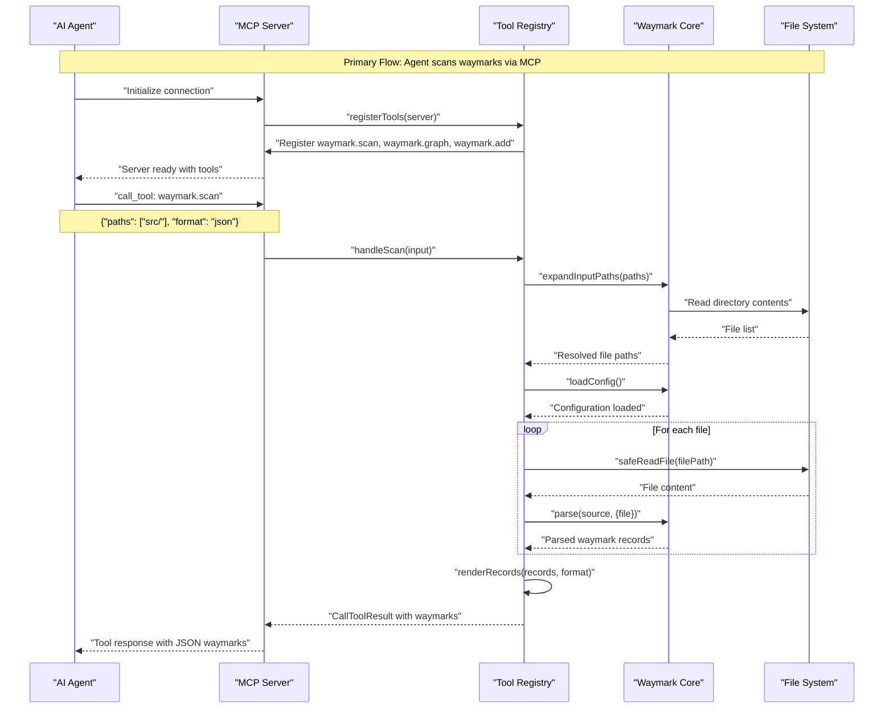

<!-- tldr ::: PR log for renaming lint rules to use named scheme -->

# PR #98: feat: rename lint rules to named scheme

**Branch:** feat-rename-lint-rules-to-named-scheme  
**State:** open  
**Last Updated:** Dec 31, 2025 at 05:03 PM

## Comments (1)

### @[object Object] • Dec 29, 2025 at 10:46 PM

General

<h3>Greptile Summary</h3>

- Refactors lint system from numbered codes (WM001, WM010) to descriptive named rules (duplicate-property, unknown-marker)
- Adds structured rule-based architecture with LintSeverity, LintRuleContext, and LintRule interfaces for extensibility  
- Updates exit code logic to only fail on errors (not warnings) and improves output formatting with rule names and messages

<h3>Important Files Changed</h3>

| Filename | Overview |
|----------|----------|
| packages/cli/src/commands/lint.ts | Completely refactored from simple type checking to structured rule-based architecture with LintRule abstraction |
| packages/cli/src/index.ts | Updated lint output formatting and exit logic to use named rules and only exit on errors |

<h3>Confidence score: 4/5</h3>

- This PR implements a significant architectural improvement to the linting system that is well-designed and consistent
- Score lowered due to incomplete testing coverage (PR states "Not run") and potential breaking changes for existing users
- Pay close attention to `packages/cli/src/commands/lint.ts` which contains the new linting architecture

<h3>Sequence Diagram</h3>



---

## Reviews (3)

### @[object Object] • Dec 29, 2025 at 10:46 PM • commented

**style:** type field is optional but was required in the old system - this could break consumers expecting it. Should type field be required to maintain backward compatibility, or is the optional approach intentional for the new rule system?

<sub>Note: If this suggestion doesn't match your team's coding style, reply to this and let me know. I'll remember it for next time!</sub>

<details><summary>Prompt To Fix With AI</summary>

`````markdown
This is a comment left during a code review.
Path: packages/cli/src/commands/lint.ts
Line: 22:22

Comment:
**style:** type field is optional but was required in the old system - this could break consumers expecting it. Should type field be required to maintain backward compatibility, or is the optional approach intentional for the new rule system?

<sub>Note: If this suggestion doesn't match your team's coding style, reply to this and let me know. I'll remember it for next time!</sub>

How can I resolve this? If you propose a fix, please make it concise.
`````

</details>

---

### @[object Object] • Dec 29, 2025 at 10:46 PM • commented

<details open><summary><h3>Additional Comments (1)</h3></summary>

1. `packages/cli/src/commands/lint.prompt.ts`, line 112 ([link](/outfitter-dev/waymark/blob/7462b0b23d6d75f319a7c8f8b2a25988fabcf454/packages/cli/src/commands/lint.prompt.ts#L112))

   **syntax:** Still references old 'WM001' code instead of the new named scheme

</details>

<sub>5 files reviewed, 2 comments</sub>

<sub>[Edit Code Review Agent Settings](https://app.greptile.com/review/github) | [Greptile](https://greptile.com?utm_source=greptile_expert&utm_medium=github&utm_campaign=code_reviews&utm_content=waymark_98)</sub>

---

### @[object Object] • Dec 29, 2025 at 10:50 PM • commented

**<sub><sub></sub></sub>  Revert config example to supported lint keys**

The config example now uses kebab‑case keys (e.g., `duplicate-property`) for lint levels, but the config parser only recognizes camelCase or snake_case keys via `setLintLevel` in `packages/core/src/config.ts` (e.g., `duplicateProperty` / `duplicate_property`). As written, users who follow this prompt will have their lint settings silently ignored, which breaks expected lint severity overrides.

---

## CI Checks (0)

*No CI checks*
