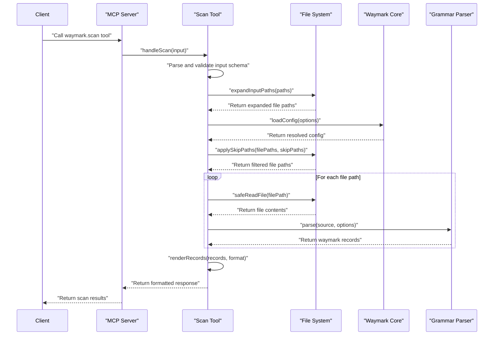

# PR #99: feat: add duplicate-property lint rule

**Branch:** feat-add-duplicate-property-lint-rule  
**State:** open  
**Last Updated:** Dec 31, 2025 at 05:03 PM

## Comments (1)

### @[object Object] • Dec 29, 2025 at 10:46 PM

General

<h3>Greptile Summary</h3>

- Adds a new `duplicate-property` lint rule to detect when waymarks have repeated property keys like `owner:@alice owner:@bob`
- Implements comprehensive property parsing logic to handle both inline and continuation properties while respecting code block boundaries
- Includes test case verification to ensure the lint rule properly detects and reports duplicate property violations

<h3>Important Files Changed</h3>

| Filename | Overview |
|----------|----------|
| packages/cli/src/commands/lint.ts | Added duplicate-property lint rule with complex parsing logic to detect repeated properties in waymarks |
| packages/cli/src/index.test.ts | Added test case to verify duplicate-property lint rule detects and reports violations correctly |

<h3>Confidence score: 2/5</h3>

- This PR has significant implementation issues that need careful review before merging
- Score lowered due to missing imports, incomplete helper function implementation, and potential parsing edge cases that could cause runtime errors
- Pay close attention to the lint.ts file which has several critical issues including missing imports and incomplete function definitions

<h3>Sequence Diagram</h3>



---

## Reviews (2)

### @[object Object] • Dec 29, 2025 at 10:46 PM • commented

**style:** Creating a new RegExp instance on every record is inefficient - consider moving this to module level

<sub>Note: If this suggestion doesn't match your team's coding style, reply to this and let me know. I'll remember it for next time!</sub>

<details><summary>Prompt To Fix With AI</summary>

`````markdown
This is a comment left during a code review.
Path: packages/cli/src/commands/lint.ts
Line: 133:133

Comment:
**style:** Creating a new RegExp instance on every record is inefficient - consider moving this to module level

<sub>Note: If this suggestion doesn't match your team's coding style, reply to this and let me know. I'll remember it for next time!</sub>

How can I resolve this? If you propose a fix, please make it concise.
`````

</details>

---

### @[object Object] • Dec 29, 2025 at 10:46 PM • commented

<sub>2 files reviewed, 1 comment</sub>

<sub>[Edit Code Review Agent Settings](https://app.greptile.com/review/github) | [Greptile](https://greptile.com?utm_source=greptile_expert&utm_medium=github&utm_campaign=code_reviews&utm_content=waymark_99)</sub>

---

## CI Checks (0)

*No CI checks*
